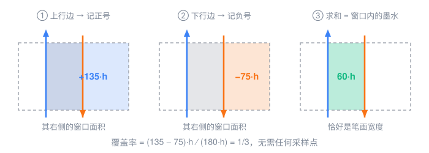
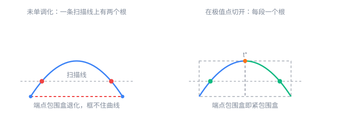
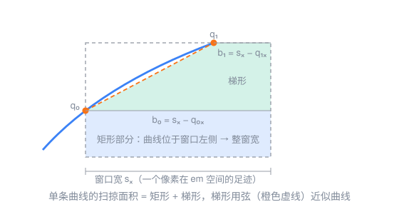
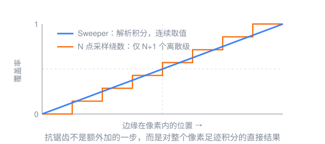
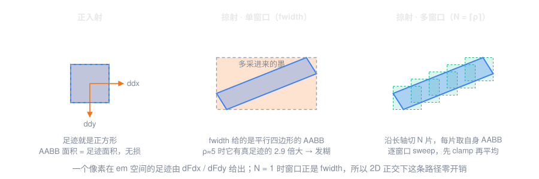

## 前言

字形渲染长期是 CPU 光栅化加 glyph cache 的天下。这套方案在 3D 场景或者任意变换下就不太灵了 —— CPU 光栅化的时候并不知道字形最终会被投影成什么样，缩放、旋转、透视之后要么糊，要么锯齿。SDF 用距离场缓解了这个问题，代价是尖角被磨圆；MSDF 用三个通道把尖角救回来，但字形复杂度一高仍然会露馅，而且两者都还得额外维护一份"距离场版本"的 glyph cache。

于是有了另一条路：把贝塞尔曲线数据直接传给 GPU，在 shader 里现场光栅化。这条路的好处很明显 —— glyph cache 变成可选项，尺寸和朝向无关，任意放大都保留尖角。Dobbie 和 Lengyel（Slug）都是这一路的代表，它们的共同点是：算 winding number，从像素采样点发一条射线，数它与曲线的有符号交点。

麻烦也出在这里。GPU 上没法指望双精度，也不能像 CPU 那样疯狂细分曲线，于是求根的精度成了老大难：曲线端点恰好落在射线上、曲线与射线相切、曲线正好穿过采样点……这些奇异情况一旦判错，绕数就会整整差 1，对应采样点非黑即白地翻转。在采样数本来就不多的前提下，这属于灾难性误差。Lengyel 的解法是把曲线按等价类分类，每一类单独决定取正根还是负根，把奇异情况一个个堵上 —— 能解决，但实现复杂度不低。

Scanline Sweeper 换了个思路：干脆不算绕数。

## 覆盖率就是一堆有符号面积

传统方法关心的是"这个采样点在不在字形内部"，一个二值判断；Sweeper 关心的是"这个像素被墨水盖住了多少"，一个连续量。这个视角的转换是整篇论文的起点。

设一个像素在 em 空间对应的矩形窗口为 $W$，字形的填充由绕数 $w(\mathbf p)$ 描述（非零填充规则下，轮廓不自交时 $w\in\{0,1\}$），那么这个像素的覆盖率就是

$$\text{coverage}=\frac{1}{|W|}\iint_{W}w(\mathbf p)\,\mathrm{d}A$$

关键一步是把 $w(\mathbf p)$ 拆开。绕数的经典算法是射线法：从 $\mathbf p$ 出发发一条水平射线，数它穿过了哪些曲线，按曲线的走向记正负号。换个说法就是，$\mathbf p$ 会不会被曲线 $C$ 计入，取决于 $\mathbf p$ 是否落在"$C$ 沿水平方向一路扫掠出来的区域"里。记这块区域为 $R(C)$，则

$$w(\mathbf p)=\sum_{C}\operatorname{sign}(C)\cdot\mathbf 1\!\left[\mathbf p\in R(C)\right]$$

把求和与积分交换：

$$\text{coverage}=\frac{1}{|W|}\sum_{C}\operatorname{sign}(C)\,\bigl|\,W\cap R(C)\,\bigr|$$

一个依赖离散事件的二值判断，就这样变成了一串面积的加加减减。每条曲线只需要回答一个问题：**把我向右扫掠，扫出来的区域和这个窗口相交了多少面积**。没有采样点，没有射线求交事件，全程待在连续域里。



上图是最能说明问题的例子：一根竖直笔画穿过某个像素窗口。左边缘上行，记正号，它右侧的窗口面积是 $135h$；右边缘下行，记负号，它右侧的面积是 $75h$。两者一加，$135h-75h=60h$，恰好就是笔画落在窗口里的那块墨水。覆盖率 $60/180=1/3$，整个过程一个采样点都没用到。

需要说明的是，"上行为正"只是相对于轮廓绕向的约定。TrueType 和 CFF 的外轮廓绕向不一样，实现时得做一次全局符号归一化。我的做法是拿一个很小的窗口在字形包围盒里做网格探测，取扫掠面积绝对值最大的那个探针的符号 —— 它必定落在字形内部，符号自然就定下来了。

## 先把曲线切成单调段

上面的推导干净，但要真的把 $|W\cap R(C)|$ 算出来，还得先给曲线立几条规矩。预处理分四步：

- 三次贝塞尔（CFF 轮廓）近似成若干段二次贝塞尔；
- 直线段升成二次（控制点取两端点的中点）；
- **水平段直接丢弃** —— 它扫掠出来的区域高度为 0，对面积没有任何贡献；
- 每段二次曲线在 $x$、$y$ 的极值处切开，直到每一段在 $[0,1]$ 上同时 $x$ 单调、$y$ 单调。

极值参数直接由一阶导为零解出：

$$t^{*}=\frac{P_0-P_1}{P_0-2P_1+P_2}$$

落在 $(0,1)$ 内才需要切。二次曲线每个轴最多一个极值，所以一条曲线最多切两刀。



单调化换来三件事，缺一不可：

1. **一条水平或垂直直线与曲线的交点，在定义域内至多一个**。求根时不用纠结该取哪个根，也就不需要一个"完全鲁棒"的二次求根器；
2. **首末控制点就是紧包围盒**。剔除只看两个点，不用考虑中间控制点；
3. **扫掠区域的形状被限死了** —— 只可能是"矩形加梯形"。

第 3 点是这个算法能写得这么短的根本原因。左图那条未切开的曲线，一条扫描线上有两个根，而且两个端点的包围盒退化成一条线段，根本框不住曲线顶部；切开之后两个问题同时消失。

## 单条曲线：矩形加梯形

对每条曲线，只需要求四个交点：与窗口上下两条扫描线的交点（沿 $y$ 求根），与窗口左右两条边界的交点（沿 $x$ 求根）。把结果 clamp 到 $[0,1]$ 后取交集，得到曲线真正落在窗口内的参数区间 $[t_{\min},t_{\max}]$，两端记作 $q_0$、$q_1$。



扫掠区域随之分成两块：

- **矩形**：曲线还在窗口左边界之外的那一段。这段 $y$ 范围内，窗口里所有点都在曲线右侧，于是贡献整个窗口宽度 $s_x$ 乘上该段高度；
- **梯形**：曲线落在窗口内部的那一段。左边界是曲线本身，右边界是窗口右边，上下底分别是 $s_x-q_{0x}$ 和 $s_x-q_{1x}$。

梯形的面积按"曲线在窗口内近似为直线"来算：

$$A_{\text{trap}}=\frac{(s_x-q_{0x})+(s_x-q_{1x})}{2}\,(q_{1y}-q_{0y})=\Bigl(s_x-\frac{q_{0x}+q_{1x}}{2}\Bigr)(q_{1y}-q_{0y})$$

一个像素的足迹本来就只有一个 em 的几十分之一，曲线又已经被切成单调段，这个尺度下曲线和弦几乎没有区别。论文也讨论过更精确的做法（把 $x$ 表示成 $y$ 的函数再换元积分），结论是收益配不上开销；真想提精度，对梯形做一两次细分要划算得多，而且不用改代码结构。

值得一提的是 clamp 的用法。把四个交点都 clamp 到窗口边界之后，各种退化情形会自动塌缩：交点落在窗口外的被压到边界上，梯形退化成三角形（一条底边长度为 0）甚至整个消失，矩形部分也可能压根不存在。代码里不需要为它们各写一个分支 —— 面积公式会自然地吸收掉这些零。

## 为什么求根可以"不那么严谨"

单调段的求根就是一个普通的二次公式，只是永远只取一个根：

$$t=\frac{-b+\operatorname{sign}(c_2-c_0)\sqrt{b^{2}-4ac}}{2a},\qquad a=c_0-2c_1+c_2,\quad b=2(c_1-c_0),\quad c=c_0-y_{\text{target}}$$

$|a|$ 很小时（论文取 $10^{-3}$）退化成线性情形，直接算 $(y_{\text{target}}-c_0)/(c_2-c_0)$。

论文列了几条"可以偷懒"的理由：控制点被限制在 em 方格附近，判别式不会溢出；只需要一个根，所以 Vieta 公式那套提精度的技巧用不上；判别式算出负数直接 clamp 到 0，因为前置的包围盒检查已经保证根存在；最终 alpha 要量化到 8 bit，下溢误差在这个精度下无关紧要。

但真正关键的是最后一条，也是整个算法最值得记住的一点：**$t$ 的扰动只会让面积估计产生同阶的扰动**。相比之下，绕数方法里一次误判就是整整 $\pm 1$，直接翻转一个采样点的黑白。这就是"待在连续域"最实在的收益 —— 数值误差从灾难性退化成了可以忽略。

## 垂直段要特判

三个控制点 $x$ 相同的垂直段需要单独走一条路径，而且不只是为了快。此时 $x$ 方向的二次式彻底退化，二次项和一次项同时为 0，走通用路径会在 $(x_{\text{target}}-c_0)/(c_2-c_0)$ 上除以零。偏偏竖直笔画又是字体里最常见的特征 —— 拉丁字母的竖干、CJK 的竖，一抓一大把。

特判之后它的贡献是一个**精确**的矩形，不含任何近似：

$$A=\operatorname{sign}(\Delta y)\cdot\min\bigl(s_x,\;s_x-p_{0x}\bigr)\cdot\bigl(y_{\text{top}}-y_{\text{bot}}\bigr)$$

其中 $y_{\text{top}}$、$y_{\text{bot}}$ 是曲线 $y$ 跨度被 clamp 到窗口后的上下界。那个 $\min$ 一次处理了两种情形：段在窗口左侧时取整个窗口宽，段落在窗口内时取从它到右边界的宽度。

## 抗锯齿是顺带的



因为算的本来就是"整个像素足迹的覆盖比例"，抗锯齿是算法的直接产物，不需要任何额外采样。这一点和绕数方法有本质区别：$N$ 个采样点最多只能表达 $N+1$ 个灰度级，边缘扫过像素时覆盖率是阶梯状跳变的；而 Sweeper 的取值填满整个 $[0,1]$ 区间，是一条连续的斜线。

窗口本身从哪来？正交投影下它在 draw 时就已知（一个像素对应多少 em）；一般情况用 `fwidth` 估计即可。窗口逐像素变化，这正是任意变换下都能正确抗锯齿的原因。论文还提到，如果想要更精确的滤波足迹，可以用 `ddx(uv)`、`ddy(uv)` 构造各向异性椭圆，再把它分解成若干个矩形窗口做线性组合 —— 算法本身只负责"给定一个矩形窗口，算出无权重盒式滤波的覆盖率"，足迹怎么拼是上层的事。

## 把字贴到 3D 平面上

上面那段话不只是个补充说明，它是 3D 的全部门票。论文原话：足迹逐像素动态变化，*"this is what permits anti-aliased glyph shading under arbitrary transformations"*。

我最初的实现把窗口写死成了一个标量 uniform —— 全屏所有像素共用一个各向同性方窗。正交投影下这没问题，换成透视就全错了：屏幕上离得远的地方，一个像素覆盖的 em 面积要大得多。

改起来意外地轻。字形四边形的局部 em 坐标本来就作为 varying 传给了片段着色器，而硬件对它做的是**透视校正插值**，所以

```glsl
vec2 ddx = dFdx(v_localEm);
vec2 ddy = dFdy(v_localEm);
```

直接就是"屏幕上走一个像素，em 空间走多远"的两个基向量。透视压缩、旋转、非均匀缩放全都已经包含在里面了 —— 不用手推雅可比，甚至不用把相机参数传进 shader。这两个向量张成的平行四边形，就是这个像素的真实足迹。

麻烦在于 sweep 要的是**轴对齐矩形**窗口。`fwidth` 给的正是这个平行四边形的 AABB，也就是论文推荐的最简做法。正入射时平行四边形本来就是正方形，AABB 和它完全重合，一点不亏；但掠射角下它被压成一条很扁的斜条，AABB 就松垮得离谱了。



图中间那个例子，各向异性比 ρ≈5，AABB 的面积是真足迹的 2.9 倍 —— 多出来的橙色部分全是这个像素其实没盖到的墨。糊就糊在这儿。

论文 §4.4 给的方子是把各向异性椭圆分解成一组矩形窗口。落到实现上我用了最直白的一种：沿长轴把平行四边形切成 $N=\lceil\rho\rceil$ 片，每片取自己的 AABB 当窗口，逐个 sweep 之后平均。这些切片**无缝无重叠地精确铺满**原平行四边形，所以：

$$\texttt{size}=\frac{|\mathbf M|}{N}+|\mathbf m|,\qquad c_i=c+\mathbf M\Bigl(\frac{i+0.5}{N}-\frac12\Bigr)$$

$\mathbf M$、$\mathbf m$ 分别是 `ddx`/`ddy` 里较长和较短的那个。有个性质很舒服：$N=1$ 时 `size` 恰好等于 $|\mathbf{ddx}|+|\mathbf{ddy}|$，也就是 `fwidth` 本身。于是 2D 正交下 $\rho=1$，$N$ 自动落回 1，这条路径**零开销、零行为差异**，不需要为 2D 和 3D 各写一条 shader 分支。

还有个细节：是**先逐窗口 clamp 再平均**，而不是求和之后统一 clamp。这样自交轮廓最多把自己那个窗口顶到 1，不会把整体均值拖过头。

最值得说的是：**核心的 sweep 一行都没改**。论文把"算一个矩形窗口的覆盖率"和"足迹怎么拼"分得很干净，实现上这个分层是直接兑现的 —— 我的 `sweeper-core.js` 从头到尾没动过，新增的只是它上面一层几十行的足迹装配。

验证还是老办法，但 ground truth 换成了**真实平行四边形**的超采样（而不是方窗）。Tinos 的 `e`、ρ≈8：单个 AABB 窗口的平均绝对误差是 0.090，切成 8 片之后降到 0.0097 —— 差了 9 倍。这个数字比任何截图都更能说明多窗口不是花架子。

对比侧则暴露出一个没法补救的不对称：SDF 每个 texel 只存了一个各向同性的距离值，压根没有可供各向异性积分的信息。所以掠射角下 Sweeper 能靠多窗口把足迹收紧，SDF 只能糊着 —— 这是烘焙式方法的固有代价，不是实现偷懒。

## 实现下来的感受

照着论文实现了一版 WebGL2 的 demo，和经典 SDF、MSDF 做分屏对比，几个数字：

- 论文附录的 `intersect_monotonic` 和 `scanline_sweep` 加起来不到 100 行，逐行翻译成 GLSL 基本不用改结构；
- 曲线数据小得惊人。Tinos 渲染一句英文大约几百条单调二次曲线，打包进 `RGBA32F` 纹理只有十几 KiB；同样这些字符的 32px/em SDF 图集要几百 KiB。论文给的数据是整套 ASCII 字符集 17.3 KiB；
- 验证方式：把 shader 逻辑原样再实现一份 JS，拿它和 16× 超采样的绕数光栅化在真实字形上逐窗口比对，平均绝对误差小于 0.05。这一步很值得做 —— 符号约定、单调化是否正确，一次就能暴露。

效果上最直观的差别是放大：


左半边是 Sweeper，右半边是 16px/em 的单通道 SDF，同一段文字、同一个变换。Sweeper 是分辨率无关的，字号拉到多大边缘都是干净的；SDF 在低分辨率图集下一放大就露出圆角和波浪边。MSDF 会好不少，但依然受图集分辨率的上限约束 —— 这是烘焙式方法的固有代价。

## 局限

论文自己也把话说在前面：

- **没有 hinting**。小字号下竖笔无法对齐像素栅格，清晰度不如带 hinting 的 CPU 光栅化。不过论文也提醒了一句：一旦文字四边形偏离像素栅格，hinting 的结果本来也不再是正确的抗锯齿，所以这个限制该不该忍取决于场景；
- **轮廓自交会让分母超过 1**。要么离线消除自交，要么在 shader 里逐轮廓分别算覆盖率再平均，后者更灵活但要改存储布局；
- **比采样一张 CPU 光栅化好的纹理贵**。论文在 1440p 下给的数据是几十到几百微秒，视字体复杂度而定。作者的建议是它和 glyph cache、UI compositor 并不冲突，可以互补。

3D 这条线上还有几条是我自己实现时留下的：

- **没走剪切变换那条路**。论文 §4.4 末尾提到，如果接受弱透视近似，可以对控制点做 2×2 QR 分解加剪切，把足迹变回轴对齐，精度最高。但剪切之后曲线不再单调，单调化必须挪到 shader 里现场做 —— 论文作者自己也说没实现过，我也没碰；
- **多窗口是分片盒式逼近，不是真正的各向异性滤波**。$N$ 有上限（我封在 8），超过这个比值的极端掠射仍然会残留模糊；
- **弱透视近似**。足迹按平行四边形处理，严格透视下一个像素映射过去其实是梯形（论文脚注 1）。实际场景里这个差别基本可以忽略；
- **只支持单一共面平面**。深度测试是关掉的，多平面互相遮挡的场景不在范围内。

## 总结

Scanline Sweeper 的核心其实一句话就能说完：把"判断采样点在不在里面"换成"积分整个像素的覆盖面积"。绕数、离散事件、奇异情况随之一起消失，抗锯齿变成免费的副产品，数值误差从灾难性退化为可忽略。

代价是需要一点预处理（单调化），以及接受一个梯形近似。但在一个像素的尺度上，这个近似几乎不要钱。

而"覆盖率是对一个矩形窗口的积分"这个定义还顺手把 3D 一起解决了：窗口从标量 uniform 换成 `dFdx`/`dFdy` 求出的逐像素平行四边形，再切成几片喂给同一个 sweep，字就能贴到 3D 平面上而不失锐利 —— 核心那不到 100 行，一个字都不用改。

参考：

- Scuff3D Rook, *The Scanline Sweeper: A Glyph Rendering Algorithm*, Rook & Possum, 2026
- E. Lengyel, *GPU-Centered Font Rendering Directly from Glyph Outlines*, JCGT 6(2), 2017
- C. Green, *Improved Alpha-Tested Magnification for Vector Textures and Special Effects*, SIGGRAPH 2007
- V. Chlumský, *Shape Decomposition for Multi-channel Distance Fields*, 硕士论文, CTU Prague, 2015
- A. Ellis, W. Hunt, J. Hart, *Real-Time Analytic Antialiased Text for 3-D Environments*, CGF 38(8), 2019

更新于 2026-07-29
