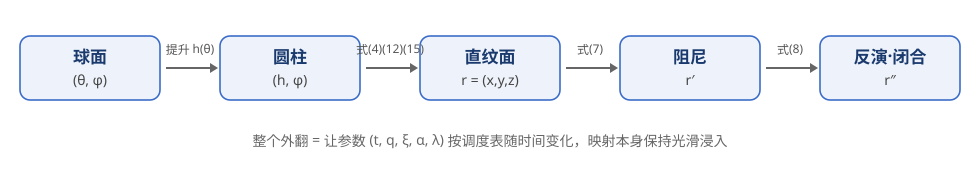
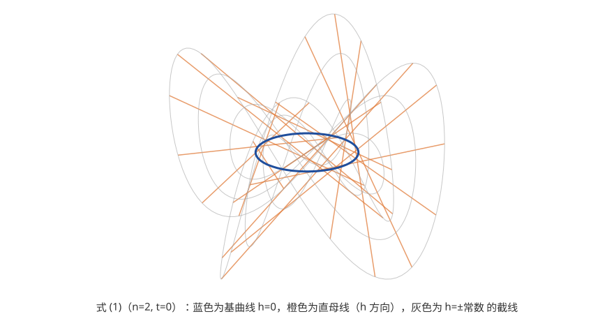
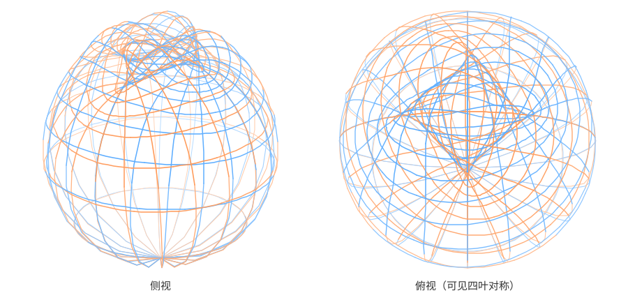
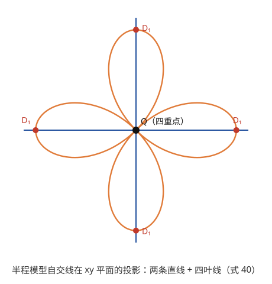
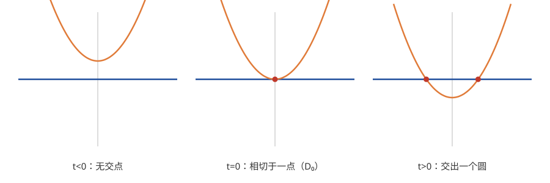
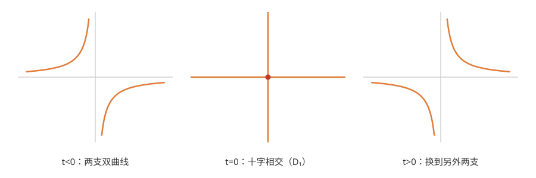
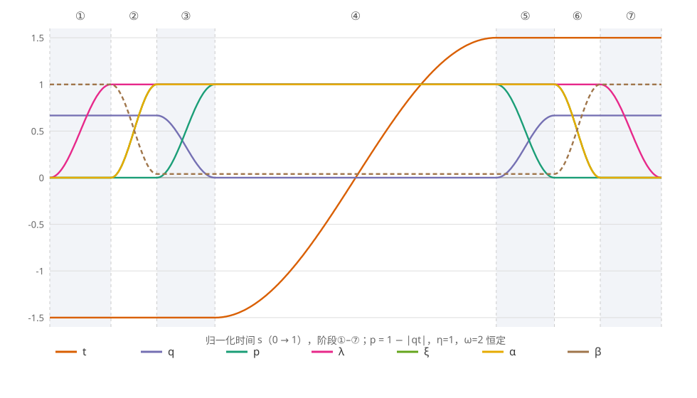
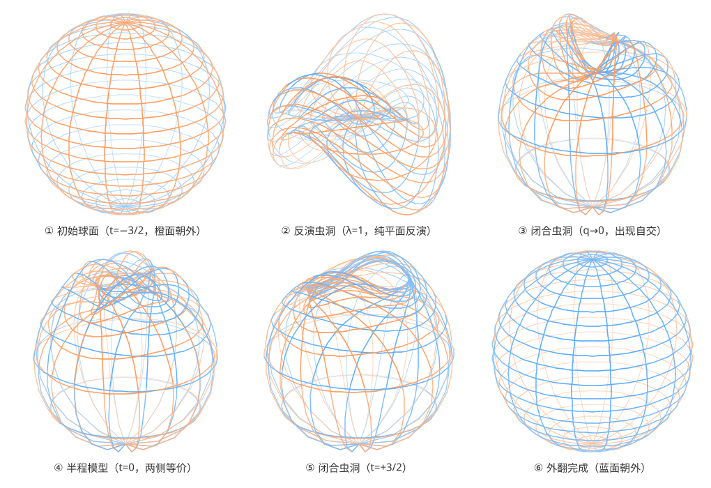
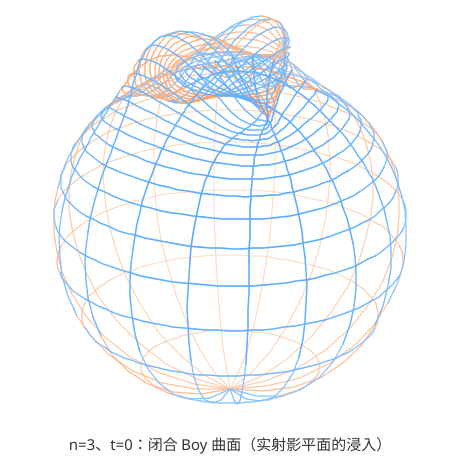

# 把球面翻个"里朝外"：用一族直纹面写出的解析球面外翻

> 本文介绍 A. Bednorz 与 W. Bednorz 的论文 *Analytic Sphere Eversion Using Ruled Surfaces*（[arXiv:1711.10466](https://arxiv.org/abs/1711.10466)）中的方法：用一族**直纹面**加上几个初等映射，写出球面外翻全过程的**显式解析公式**——每一时刻的曲面都有闭式参数方程，且整个过程只经历拓扑上不可避免的最少"事件"。文末附我们据此实现的交互式 WebGL 演示。
>
> 阅读门槛：会偏导数、叉积和复数运算即可，不需要拓扑学背景。

---

## 1. 这是一个正经的数学问题

想象一个理想的球面：它没有厚度，材料像幽灵一样**允许自己穿过自己**，但必须时刻保持**光滑**——不许出现折痕、尖点，更不许撕裂。问：能否通过连续变形，把球面的内侧翻到外面？

先看两个直觉答案为什么都不对：

- "直接把两极往里压，像翻袜子一样"——不行。翻袜子靠的是袜口，封闭球面没有口；硬压到中途赤道会被挤出一圈**折痕**，违反光滑性。
- "既然能穿过自己，那随便捏过去不就行了"——自穿透确实允许，但变形每一瞬间都要维持光滑浸入，这个约束相当苛刻。

作为对比，**平面上的圆翻不过来**。平面闭曲线沿途切方向转过的总圈数叫**转数**（turning number），它在光滑变形（正则同伦）下不变——这是 Whitney–Graustein 定理。逆时针圆的转数是 $+1$，"翻面"后的圆是 $-1$，所以不存在从一个到另一个的光滑变形。

令人惊讶的是，1958 年 Smale 证明：**球面的对应障碍恰好消失**，球面外翻（sphere eversion）存在！用公式说，记 $\vec R\in S^2$ 为球面上的点，存在连续依赖时间 $t$ 的光滑浸入族 $\vec r(\vec R, t)$，使得

$$
\vec r(\vec R, t_-) = \vec R, \qquad \vec r(\vec R, t_+) = -\vec R .
$$

终点的 $-\vec R$ 是**对径映射**：它把球面映回同一个球面，但原先朝外的那一侧现在朝内（第 7 节会严格验证这一点）。

Smale 的证明是抽象的存在性证明，完全不告诉你"怎么翻"。此后几十年，数学家们给出了各种可视化方案：Boy/Morin 的图画式外翻、Thurston 的波纹法（纪录片 *Outside In*）、基于 Willmore 能量的数值极小化（*The Optiverse*）等。但它们要么只有图没有公式，要么公式极其复杂，要么依赖数值计算。**本文方法的贡献**是：全程闭式解析公式 + 最少拓扑事件，两者兼得。

这里"光滑浸入"的判据很具体：曲面参数化 $\vec r(h,\varphi)$ 是浸入，当且仅当两个切向量处处线性无关，即法向量

$$
\vec n = \vec r_h \times \vec r_\varphi \neq \vec 0
$$

处处成立（下标表示偏导）。全文所有"光滑性证明"最后都归结为验证这一条。

## 2. 方法总览：五步映射管线

整个构造是一条映射链（论文式 11）：

$$
(\theta,\varphi)\;\longrightarrow\;(h,\varphi)\;\longrightarrow\;\vec r=(x,y,z)\;\longrightarrow\;\vec r{\,}'\;\longrightarrow\;\vec r{\,}''
$$

1. **球面坐标** $(\theta,\varphi)$：$\theta\in[-\tfrac\pi2,\tfrac\pi2]$ 是纬度，$\varphi$ 是经度；
2. **提升到无限长圆柱**：$h=\omega\sin\theta/\cos^n\theta$，两极对应 $h\to\pm\infty$；
3. **直纹面族**（核心）：把圆柱 $(h,\varphi)$ 映成一张随参数扭转、平移的直纹面；
4. **阻尼映射**：把伸向无穷远的部分按幂律压缩；
5. **反演闭合**：类似球极投影的反演，把圆柱两端"收拢"，得到闭合曲面。

外翻本身则由**参数调度**完成：管线里有一组参数 $(t,q,p,\lambda,\xi,\eta,\alpha,\beta)$，让它们按论文表 1 的时间表连续变化，曲面就从"橙面朝外的球"光滑地变形为"蓝面朝外的球"。

## 3. 主角：一族会扭的直纹面

**直纹面**（ruled surface）是由一族直线扫出的曲面：每点都落在完全包含于曲面内的某条直线（母线）上。圆柱、锥面、单叶双曲面、马鞍面都是例子。

论文的核心公式（式 3，参数 $t$ 先当作常数）是：

$$
\begin{aligned}
x &= t\cos\varphi + \sin\!\big((n{-}1)\varphi\big) - h\sin\varphi,\\
y &= t\sin\varphi + \cos\!\big((n{-}1)\varphi\big) + h\cos\varphi,\\
z &= h\sin n\varphi - \tfrac{t}{n}\cos n\varphi,
\end{aligned}
\qquad n\ge 2 .
$$

它确实是直纹面——固定 $\varphi$、让 $h$ 变化，就得到一条直线：

$$
\vec r(h,\varphi) = \underbrace{\Big(t\cos\varphi + \sin(n{-}1)\varphi,\;\; t\sin\varphi + \cos(n{-}1)\varphi,\;\; -\tfrac tn\cos n\varphi\Big)}_{\text{基曲线 } \vec B(\varphi)} \;+\; h\,\underbrace{\Big(-\sin\varphi,\; \cos\varphi,\; \sin n\varphi\Big)}_{\text{母线方向 } \vec D(\varphi)} .
$$

注意两个"转速"的错位：当 $\varphi$ 走一圈，基曲线中的 $\big(\sin(n{-}1)\varphi,\cos(n{-}1)\varphi\big)$ 转了 $n{-}1$ 圈，而母线方向 $(-\sin\varphi,\cos\varphi)$ 只转 $1$ 圈，同时母线的竖直分量 $\sin n\varphi$ 振荡 $n$ 次。这种错位正是自交与"扭转"的来源——它让曲面在中部卷绕，而在 $|h|$ 很大处（母线主导）近似普通圆柱。

### 3.1 半程模型与它的对称性

取 $n=2$、$t=0$（论文式 1），得到外翻的**半程模型**（halfway model）——变形进行到正中间时的曲面：

$$
x=(1-h)\sin\varphi,\qquad y=(1+h)\cos\varphi,\qquad z=h\sin 2\varphi .
$$

*线框颜色表示朝向（橙/蓝两面），远处线条淡化。俯视图可见明显的四叶对称。*

为什么说它是"半程"？因为它的两面完全等价：**绕 $z$ 轴旋转 $90^\circ$ 恰好把这张曲面映回自身，同时交换两面**。验证：做参数替换 $(h,\varphi)\to(-h,\varphi+\tfrac\pi2)$，

$$
\begin{aligned}
x(-h,\varphi+\tfrac\pi2) &= (1+h)\cos\varphi = y,\\
y(-h,\varphi+\tfrac\pi2) &= -(1-h)\sin\varphi = -x,\\
z(-h,\varphi+\tfrac\pi2) &= -h\sin(2\varphi+\pi) = h\sin 2\varphi = z .
\end{aligned}
$$

即曲面上的点 $(x,y,z)$ 被送到 $(y,-x,z)$——正是绕 $z$ 轴的 $-90^\circ$ 旋转。关键在定向：参数替换 $(h,\varphi)\to(-h,\varphi+\tfrac\pi2)$ 的雅可比行列式为 $(-1)\times 1=-1$（反定向），而空间旋转保持定向，两者合起来意味着**法向量被翻转**——旋转把曲面的 A 面贴到 B 面上。既然一个刚体运动就能交换两面，那么两面地位完全对称，这张曲面就是外翻旅程的"正中点"：从它出发向两个方向做互为镜像的变形，一头通到"橙面朝外"，另一头通到"蓝面朝外"。

## 4. 光滑性：一次复数技巧的完整推导

外翻过程中还要用到两个变形参数：$p$（扭转项的幅度）与 $q$（一个剪切修正），完整的直纹面族是（论文式 4）：

$$
\begin{aligned}
x &= t\cos\varphi + p\sin(n{-}1)\varphi - h\sin\varphi,\\
y &= t\sin\varphi + p\cos(n{-}1)\varphi + h\cos\varphi,\\
z &= h\sin n\varphi - \tfrac tn\cos n\varphi - qth .
\end{aligned}
$$

现在证明它在条件

$$
(n-1)\,p\,(1-q|t|) + q\,t^2 \;>\; 0 \tag{$\ast$}
$$

下是浸入（论文式 5）。这个推导是全文技术含量最高的一段，但只用复数和叉积。

**复数记号。** 令 $w=x+iy$，$u=e^{i\varphi}$（于是 $\bar u^{\,n-1}=e^{-i(n-1)\varphi}$）。式 (4) 的前两行合并为一行：

$$
w = t\,u + i\big(h\,u + p\,\bar u^{\,n-1}\big) .
$$

（不妨自己展开实部虚部核对一遍。）曲面写成 $\vec r=(w,z)$。

**切向量。** 利用 $\partial_\varphi u = iu$、$\partial_\varphi \bar u^{\,n-1} = -i(n{-}1)\bar u^{\,n-1}$：

$$
\vec r_h = \big(iu,\;\; \sin n\varphi - qt\big),\qquad
\vec r_\varphi = \big(itu - hu + (n{-}1)p\,\bar u^{\,n-1},\;\; nh\cos n\varphi + t\sin n\varphi\big).
$$

**叉积的复数形式。** 对 $\vec a=(w_a,z_a)$、$\vec b=(w_b,z_b)$，把叉积 $\vec n=\vec a\times\vec b$ 的三个分量按定义展开、再合并成复数，可得恒等式（建议动手验证，两行即可）：

$$
n_x+i n_y = i\,(z_a w_b - z_b w_a),\qquad
n_z = \operatorname{Im}(\bar w_a\, w_b).
$$

**计算 $n_z$。** 取 $\vec a=\vec r_h,\ \vec b=\vec r_\varphi$。注意 $\bar w_a=-i\bar u$，且 $u\bar u=1$：

$$
\bar w_a w_b = -i\bar u\big(itu-hu+(n{-}1)p\bar u^{\,n-1}\big) = t + ih - i(n{-}1)p\,\bar u^{\,n},
$$

取虚部（用 $\operatorname{Re}\bar u^{\,n}=\cos n\varphi$）：

$$
\boxed{\;n_z = h - (n-1)\,p\cos n\varphi\;}
$$

**在 $n_z=0$ 处检查水平分量。** 只有当 $h=(n{-}1)p\cos n\varphi$ 时才可能出问题，此时需要 $(n_x,n_y)\ne 0$。把切向量代入复数叉积公式并乘以 $\bar u$（乘单位复数不改变模长）：

$$
(n_x+in_y)\,\bar u = (\sin n\varphi - qt)\big({-}t - ih + i(n{-}1)p\,\bar u^{\,n}\big) + nh\cos n\varphi + t\sin n\varphi .
$$

代入 $h=(n{-}1)p\cos n\varphi$ 后整理，**虚部恰好为零**（它含因子 $(n{-}1)p\cos n\varphi - h$），而实部为

$$
\operatorname{Re}\big[(n_x+in_y)\bar u\big] = (n-1)\,p\,\Big(n-(n-1)s^2 - qts\Big) + qt^2,
\qquad s:=\sin n\varphi\in[-1,1].
$$

右端作为 $s$ 的函数是开口向下的抛物线（$s^2$ 系数为 $-(n{-}1)^2p<0$），最小值在端点 $s=\pm1$ 取得；取 $s=\operatorname{sgn} t$ 时更小，为

$$
(n-1)\,p\,(1-q|t|)+qt^2 .
$$

只要它 $>0$，法向量就处处非零——这正是条件 $(\ast)$。特别地，当 $q=0,\ p=1$（外翻的中心阶段）时条件化为 $n-1>0$，**永远成立**：这族曲面对任意 $t$ 都是光滑浸入。$\blacksquare$

## 5. 自交结构与拓扑事件

嵌入（无自交）的球面把空间分成内外两部分，"哪面朝外"是连续不变的属性——所以**外翻中途必须出现自交**。变形过程中自交模式发生质变的瞬间称为**拓扑事件**。理解一次外翻，很大程度上就是理解它的事件序列。

先看半程模型（$n=2,\ t=0$）的自交集：解方程"两组参数 $(h_1,\varphi_1)\neq(h_2,\varphi_2)$ 映到同一点"（论文附录 D 用和差化积完成，思路初等但较长），结果是三条曲线：$x$ 轴、$y$ 轴，以及一条空间四叶线（式 40）：

$$
x=\mp\sqrt2\,\cos\varphi\cos 2\varphi,\qquad
y=\pm\sqrt2\,\sin\varphi\cos 2\varphi,\qquad
z=\tfrac12\sin 4\varphi .
$$

图中原点是**四重点** $Q$——曲面的四层在这一点相遇。可以直接验证：把 $(h,\varphi)=(1,\pm\tfrac\pi2),\ (-1,0),\ (-1,\pi)$ 四组参数代入半程模型公式，全部映到 $(0,0,0)$。例如 $(1,\tfrac\pi2)$：$x=(1{-}1)\sin\tfrac\pi2=0$，$y=(1{+}1)\cos\tfrac\pi2=0$，$z=\sin\pi=0$。四叶线与坐标轴的四个交点 $(\pm\sqrt2,0,0),(0,\pm\sqrt2,0)$ 是四个 $D_1$ 点。

### 5.1 事件的局部模型

每类事件都可以用两三张平面的局部标准形来理解（事件的本质只取决于点附近的行为）。

**$D_0/D_2$：自交环的诞生/消亡。** 固定平面 $z=0$，运动曲面 $z=x^2+y^2-t$：

$t<0$ 不相交；$t=0$ 相切于一点；$t>0$ 交出一个圆。正向经过叫 $D_0$（环诞生），反向叫 $D_2$（环消亡）。

**$D_1$：鞍点换轨。** 固定 $z=0$，运动曲面 $z=xy-t$，交线是 $xy=t$：

两支双曲线经过"十字"瞬间交换了连接方式——自交线网络的重新接线。

**$T_\pm$：三重点成对生灭。** 三张曲面一般位置下交于孤立三重点。局部模型：固定 $|x|=|y|$ 两平面，运动面 $x=z^2-t$；$t$ 增大穿过 $0$ 时，一对三重点同时诞生（$T_+$），反向则消亡（$T_-$）。

**$Q$：四重点。** 固定 $x=0,y=0,z=0$ 三平面，运动面 $x+y+z=t$：仅在 $t=0$ 一瞬四面共点。Banchoff–Max 与 Hughes 证明过一个深刻的定理：**任何球面外翻都必须在某个时刻出现四重点**——$Q$ 不是这个构造的缺陷，而是所有外翻的宿命。

### 5.2 本模型的事件时刻表

$n=2$ 的模型把这些事件安排得干净利落（$t$ 从 $-\tfrac32$ 扫到 $+\tfrac32$，$q$ 阶段见下节）：

| 时刻 | 事件 | 位置 |
|---|---|---|
| $q\lvert t\rvert$ 离开 $1$ 的瞬间 | $D_{01}$（无交 $\to$ 相交，发生于无穷远） | 无穷远 |
| $t=-1$ | $D_0$：中央自交环诞生 | 原点 |
| $t=-\tfrac{\sqrt{17}-3}{2}\approx-0.56$ | 一对 $T_+$：四个三重点诞生 | $z=0$ 平面 |
| $t=0$（半程） | $Q$ 四重点 + 四个 $D_1$ | 原点与四叶线 |
| $t=+0.56$ | 一对 $T_-$ | 对称位置 |
| $t=+1$ | $D_2$ | 原点 |
| $q\lvert t\rvert$ 回到 $1$ 的瞬间 | $D_{21}$ | 无穷远 |

这正是已知拓扑复杂度最低的外翻事件序列——此前只在图画式与数值模型中实现过，从未有过解析公式。$T_\pm$ 的时刻 $t=\pm\tfrac{\sqrt{17}-3}2$ 来自论文附录 F：利用对称性设三重点在 $x=\pm y,\ z=0$ 上，联立后化为一元二次方程 $t^2-3t-2=0$（对 $x=-y$ 为 $t^2+3t-2=0$），取合适的根即得。

### 5.3 解开自交：$q$ 参数

中心阶段结束后（$|t|>1$），曲面仍有自交。参数 $q$ 的作用是把 $z$ 分量加上剪切 $-qth$，同时让 $p$ 退到 $1-|qt|$：当 $q|t|\to1$ 时 $p\to0$，式 (4) 化为

$$
x = t\cos\varphi - h\sin\varphi,\quad
y = t\sin\varphi + h\cos\varphi,\quad
z = h\sin n\varphi - \tfrac tn\cos n\varphi \mp h,
$$

一张**无自交**的规则"管面"。整个 $q$ 过程满足光滑性条件 $(\ast)$：代入 $p=1-q|t|$ 得 $(n-1)(1-q|t|)^2+qt^2$，两项不同时为零。

## 6. 从圆柱到球面 I：把无穷远收回来

到目前为止的曲面是无限长的（$h\in\mathbb R$），要变成球面还差两步：先把远端压缩，再把两端收拢闭合。这一步骤有个形象的绰号——给"虫洞"封口。

**提升。** 用 $h=\omega\sin\theta/\cos^n\theta$ 把 $\theta\in[-\tfrac\pi2,\tfrac\pi2]$ 映满 $h\in(-\infty,+\infty)$，圆柱的两端对应球面的两极。分母取 $\cos^n\theta$ 而非 $\cos\theta$，是为了配合后续映射让两极成为**光滑**点（见第 9 节）。

**阻尼（论文式 7）。** 记 $\kappa=\tfrac{n-1}{2n}$：

$$
x' = \frac{x}{(\xi+\eta(x^2+y^2))^{\kappa}},\qquad
y' = \frac{y}{(\xi+\eta(x^2+y^2))^{\kappa}},\qquad
z' = \frac{z}{\xi+\eta(x^2+y^2)} .
$$

在远端 $|h|\to\infty$ 处 $x^2+y^2\sim h^2$，而 $z\sim h\sin n\varphi$ 无界振荡；阻尼让 $z'\to0$、水平半径按幂律 $|h|^{1-2\kappa}$ 增长——为反演做好准备。

**反演闭合（论文式 8）。** 记 $\rho'=x'^2+y'^2$，$\gamma=2\sqrt{\alpha\beta}$：

$$
x'' = \frac{x'\,e^{\gamma z'}}{\alpha+\beta\rho'},\qquad
y'' = \frac{y'\,e^{\gamma z'}}{\alpha+\beta\rho'},\qquad
z'' = \frac{\alpha-\beta\rho'}{\alpha+\beta\rho'}\cdot\frac{e^{\gamma z'}}{\gamma} - \frac1\gamma\cdot\frac{\alpha-\beta}{\alpha+\beta} .
$$

只要 $\beta>0$，远端 $\rho'\to\infty$ 时 $x'',y''\to0$、$z''\to$ 有限值：**两个无穷远端被收拢到 $z$ 轴上的同一点**，无限圆柱闭合成（浸入的）球面。参数球面的两极映到同一空间位置——这对浸入完全合法。

$\alpha\to0,\ \beta=1$ 时该映射退化为标准的"平面反演 + 翻转"：

$$
x''=\frac{x'}{\rho'},\qquad y''=\frac{y'}{\rho'},\qquad z''=-z' .
$$

这个极限值得亲手推一遍，因为它同时是数值实现的关键。令 $f=\frac{\alpha-\beta\rho'}{\alpha+\beta\rho'}$，$g=\frac{\alpha-\beta}{\alpha+\beta}$，则

$$
z'' = \frac{f e^{\gamma z'}-g}{\gamma}
= f\cdot\frac{e^{\gamma z'}-1}{\gamma} + \frac{f-g}{\gamma}.
$$

直接通分可得 $f-g = \dfrac{2\alpha\beta\,(1-\rho')}{(\alpha+\beta\rho')(\alpha+\beta)}$，除以 $\gamma=2\sqrt{\alpha\beta}$：

$$
z'' = f\cdot z'E_1(\gamma z') + \frac{\sqrt{\alpha\beta}\,(1-\rho')}{(\alpha+\beta\rho')(\alpha+\beta)},
\qquad E_1(v):=\frac{e^v-1}{v}.
$$

右端已经没有任何 $1/\gamma$ 奇性：$\alpha\to0$ 时 $f\to-1$、$E_1\to1$、第二项 $\to0$，干净地退化为 $z''=-z'$。

## 7. 从圆柱到球面 II：舒展成圆球

反演闭合后的曲面拓扑上已是球面，但形状仍是压扁扭曲的。最后一个参数 $\lambda\in[0,1]$ 把它舒展成标准圆球（论文式 12、15；此时 $p=0$、$q|t|=1$、$\xi=0$、$\alpha=0$、$\beta=1$、反演化为上面的平面反演形式）：

$$
\begin{aligned}
x &= \frac{t\big(1-\lambda+\lambda\cos^n\theta\big)\cos\varphi - \lambda\,\omega\sin\theta\,\sin\varphi}{\cos^n\theta},\\[2pt]
y &= \frac{t\big(1-\lambda+\lambda\cos^n\theta\big)\sin\varphi + \lambda\,\omega\sin\theta\,\cos\varphi}{\cos^n\theta},\\[2pt]
z &= \lambda\Big(\tfrac{\omega\sin\theta\,(\sin n\varphi-qt)}{\cos^n\theta} - \tfrac tn\cos n\varphi\Big) - (1-\lambda)\,\eta^{1+\kappa}\,t\,|t|^{2\kappa}\,\frac{\sin\theta}{\cos^{2n}\theta}.
\end{aligned}
$$

$\lambda=1$ 时恰是上一节的无自交管面；$\lambda=0$ 时我们来**完整验证它是圆球**——这是整个构造的收官一击。

$\lambda=0$ 代入：$x=\dfrac{t\cos\varphi}{\cos^n\theta}$，$y=\dfrac{t\sin\varphi}{\cos^n\theta}$，$z=-\eta^{1+\kappa}t|t|^{2\kappa}\dfrac{\sin\theta}{\cos^{2n}\theta}$，于是 $x^2+y^2=\dfrac{t^2}{\cos^{2n}\theta}$。经过阻尼（$\xi=0$）与平面反演的复合，等价于（论文式 10）：

$$
x''=\frac{\eta^{\kappa}\,x}{(x^2+y^2)^{1-\kappa}},\qquad
y''=\frac{\eta^{\kappa}\,y}{(x^2+y^2)^{1-\kappa}},\qquad
z''=-\frac{z/\eta}{x^2+y^2}.
$$

代入并利用 $2n(1-\kappa)=n+1$、$2\kappa-1=-\tfrac1n$：

$$
x'' = \eta^\kappa\cdot\frac{t\cos\varphi}{\cos^n\theta}\cdot\frac{\cos^{n+1}\theta}{|t|^{(n+1)/n}}
= \operatorname{sgn}(t)\,\eta^{\kappa}|t|^{-1/n}\,\cos\theta\cos\varphi,
$$

同理 $y''=\operatorname{sgn}(t)\,R\cos\theta\sin\varphi$，且

$$
z'' = \eta^{1+\kappa}t|t|^{2\kappa}\frac{\sin\theta}{\cos^{2n}\theta}\cdot\frac{\cos^{2n}\theta}{\eta\,t^2}
= \operatorname{sgn}(t)\,\eta^{\kappa}|t|^{-1/n}\sin\theta .
$$

三式合并，记 $\hat n(\theta,\varphi)=(\cos\theta\cos\varphi,\ \cos\theta\sin\varphi,\ \sin\theta)$（单位球面），$R=\eta^\kappa|t|^{-1/n}$：

$$
\boxed{\;\vec r{\,}'' = \operatorname{sgn}(t)\cdot R\,\hat n(\theta,\varphi)\;}
$$

**$t=-\tfrac32$ 时是对径球面 $-R\hat n$，$t=+\tfrac32$ 时是标准球面 $+R\hat n$**——正是第 1 节里 Smale 定理的两个端点！

### 7.1 为什么"对径"就意味着翻了面

给曲面的两面涂色：法向量 $\vec N=\vec r_\theta\times\vec r_\varphi$ 指向的一面涂橙色，另一面涂蓝色。先算单位球的一个基本量（两行叉积，建议动手）：

$$
\partial_\theta\hat n\times\partial_\varphi\hat n = -\cos\theta\,\hat n .
$$

- **终点** $\vec r{\,}''=+R\hat n$：$\vec N = R^2(\partial_\theta\hat n\times\partial_\varphi\hat n) = -R^2\cos\theta\,\hat n$，指向球心——**橙面朝内**。
- **起点** $\vec r{\,}''=-R\hat n$：两个偏导各带一个负号，叉积不变：$\vec N=-R^2\cos\theta\,\hat n$。但此时曲面上的点位于 $-R\hat n$，那里的"朝外"方向是 $-\hat n$，因此 $\vec N=R^2\cos\theta\,(-\hat n)$ 沿着朝外方向——**橙面朝外**。

同一个球面、同一套涂色，起点橙面朝外，终点橙面朝内。外翻完成。$\blacksquare$

## 8. 完整时间轴

论文表 1 给出参数调度（$Q<1$ 任取，演示取 $Q=\tfrac23$，即 $|t|_{\max}=\tfrac1Q=\tfrac32$；恒取 $p=1-|qt|$，$\eta=1$，$\omega=2$）：

| 阶段 | $\lvert t\rvert$ | $q$ | $\xi$ | $\alpha$ | $\lambda$ |
|---|---|---|---|---|---|
| 球面 | $1/Q$ | $Q$ | $0$ | $0$ | $0$ |
| 反演虫洞 | $1/Q$ | $Q$ | $0$ | $0$ | $1$ |
| 展开虫洞 | $1/Q$ | $Q$ | $1$ | $>0$ | $1$ |
| 闭合虫洞 | $<1/Q$ | $0$ | $1$ | $>0$ | $1$ |

从下往上读是前半程（$t<0$），到顶后让 $t$ 从 $-\tfrac1Q$ 线性扫到 $+\tfrac1Q$（穿过半程模型），再从上往下读回去。相邻两行之间只需线性插值那些不同的参数。全程七个阶段：

*各参数随归一化时间的变化（$\xi$ 与 $\alpha$ 在此调度下重合；$\beta$ 为虚线，仅影响显示比例，论文允许任意正值）。*

对应的曲面形态：

*线框颜色编码朝向（橙=起始外侧面，蓝=起始内侧面），远处线条淡化。① 与 ⑥ 是同一个圆球，但朝外的面已互换。*

## 9. 数值实现笔记：极点与 GPU

把公式变成能跑的演示程序时有一个必须解决的问题：**极点发散**。$\theta\to\pm\tfrac\pi2$ 时 $h\to\infty$，中间量 $x,y,z$ 全部发散，虽然最终的 $\vec r{\,}''$ 有限，浮点数却早已溢出。论文附录 G 给出了改写：引入

$$
C=\cos^2\theta,\qquad Z=\sin\theta,\qquad W=e^{i\varphi}\cos\theta,
$$

先把关键量整理成**多项式**。例如对复数形式 $w=tu+i(hu+p\bar u^{\,n-1})$ 直接展开模方：

$$
|w|^2 = t^2+h^2+p^2+2p\big(h\cos n\varphi + t\sin n\varphi\big),
$$

代入 $h=\omega Z/C^{n/2}$ 并乘以 $C^{\,n}$，所有负幂恰好消光：

$$
R:=C^{\,n}|w|^2 = \omega^2Z^2 + C^{\,n}(t^2+p^2) + 2p\,\omega Z\operatorname{Re}W^n + 2pt\,C^{n/2}\operatorname{Im}W^n,
$$

这是 $(W,Z)$ 的多项式，在极点（$C=0$）处取值 $\omega^2>0$，完全良定。类似地把 $w\cos^{n+1}\theta$、$z\cos^{2n}\theta$ 都整理成光滑量，整条管线就可以写成"分子分母都有限、分母恒正"的形式：

$$
w'' = \frac{A\,R'^{\,\kappa}\,e^{\gamma z'}}{C\alpha R'^{\,2\kappa}+\beta R},\qquad
z'' = \frac{C\alpha R'^{\,2\kappa}-\beta R}{C\alpha R'^{\,2\kappa}+\beta R}\; z'E_1(\gamma z')
+ \frac{\sqrt{\alpha\beta}\,\big(CR'^{\,2\kappa}-R\big)}{\big(C\alpha R'^{\,2\kappa}+\beta R\big)(\alpha+\beta)},
$$

其中 $A=w\cos^{n+1}\theta$，$R'=\xi C^{\,n}+\eta R$，$z'=zC^{\,n}/R'$，$E_1$ 是第 6 节推导的无奇点辅助函数（小宗量用泰勒级数 $E_1(v)\approx 1+\tfrac v2+\tfrac{v^2}6$）。这组公式可以整段放进 GPU 顶点着色器：几何全部由显卡逐帧求值，动画只是改几个 uniform 参数。我们的实现与论文原始公式在全时间轴随机采样下的最大相对误差为 $8\times10^{-15}$（双精度），两个端点与理论圆球的偏差在 $10^{-16}$ 量级。

交互演示：[sphere_eversion.html](../sphere_eversion.html)（纯 canvas + WebGL，无第三方库；支持拖动旋转、时间轴拖拽、X 射线与剖切模式）。

## 10. 彩蛋：$n=3$ 与 Boy 曲面

公式族对一切 $n\ge2$ 都成立。取 $n=3$、$t=0$ 时发生一件有趣的事：参数替换 $(h,\varphi)\to(-h,\varphi+\pi)$ 把每个点映到**同一个空间位置但朝向相反**——曲面成为**二重覆盖**，其单层的像正是著名的 **Boy 曲面**：实射影平面 $\mathbb{RP}^2$（把球面对径点粘合所得的不可定向曲面）在三维空间中的光滑浸入。它只有一个三重点，自交线的投影是三叶线，代数上是一张五次曲面（论文附录 E 只用几步复数消元就导出了它的隐式方程）。

用 $n=3$ 同样可以完成整套外翻（$t\neq0$ 时二重覆盖分裂成普通的浸入球面），只是拓扑事件比 $n=2$ 多，不再是最简方案。

## 11. 结语

这套构造的美妙之处在于**分工明确**：直纹面族负责"扭"（制造并管理自交），阻尼与反演负责"收"（把无限圆柱闭合成球），$\lambda$ 负责"整形"（舒展成圆球），而外翻的全部动力学都浓缩在一张参数调度表里。每一步都初等——三角函数、复数、叉积、反演——组合起来却解决了一个曾经只有抽象存在性证明的问题：不仅告诉你球面能翻过来，还把每一瞬间的曲面**写给你看**。

## 参考文献

1. S. Smale, *A classification of immersions of the two-sphere*, Trans. Amer. Math. Soc. **90** (1959), 281–290.
2. B. Morin, J.-P. Petit, *Le retournement de la sphère*, C. R. Acad. Sci. Paris **287** (1978).
3. F. Apéry, *An algebraic halfway model for the eversion of the sphere*, Tohoku Math. J. **44** (1992), 103–150.
4. S. Levy, D. Maxwell, T. Munzner, *Outside In*（纪录片）, The Geometry Center, 1994.
5. G. Francis, J. M. Sullivan et al., *The minimax sphere eversion*, in *Visualization and Mathematics*, Springer, 1997.
6. T. Banchoff, N. L. Max（四重点必然性）, in *Contributions to Analysis and Geometry*, Johns Hopkins Univ. Press, 1981; J. Hughes, Amer. J. Math. **107** (1985), 501–505.
7. A. Bednorz, W. Bednorz, *Analytic sphere eversion using ruled surfaces*, [arXiv:1711.10466](https://arxiv.org/abs/1711.10466).
