# 让球面自己翻过来：极小极大外翻的完整推导

> 本文讲的是 Francis、Sullivan、Kusner、Brakke、Hartman、Chappell 1996 年的论文 *The Minimax Sphere Eversion*（收于 *Visualization and Mathematics*, Springer 1997, pp. 3–20）所描述的方法，并把它从公式一路推到可以在浏览器里跑起来的代码。
>
> 预设读者：学过微积分、线性代数、复数的理工科本科生。不预设微分几何或拓扑学基础 —— 需要的概念我都会现场搭起来。

---

## 0. 先看结果

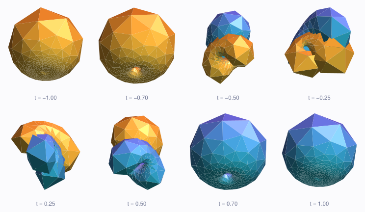

上面这一排是同一张球面。最左边是一个橙色朝外的球；最右边是同一张球面，但**蓝色朝外**了 —— 里面翻到了外面。中间它经历了一系列奇形怪状的中间态，其中会穿过自己，但**从头到尾没有出现任何折痕、尖点或者撕裂**。

这件事叫**球面外翻**（sphere eversion）。它反直觉到什么程度？1958 年 Smale 证明它可行时，据说连同行都先入为主地认为他一定推错了 —— 因为低一维的类比明摆着不成立（见 §1）。

更有意思的是这一排图的来历：它不是人设计出来的。我们只做了两件事：

1. 写下一个特定的曲面（"半程模型"）；
2. 让它顺着一个能量的梯度往下滚。

剩下的全部形状 —— 那些凹陷、颈部、腰果形 —— 都是**能量最小化自己找出来的**。

---

## 1. "翻过来"到底是什么意思

先把问题说清楚。给你一个橡皮球面，外面涂橙色，里面涂蓝色。要求把它变形成蓝色朝外的样子，规则是：

- **可以**穿过自己（橡皮是"幽灵"材质，两层可以互相穿透）；
- **可以**任意拉伸压缩；
- **不可以**出现折痕、尖点、撕裂 —— 曲面必须**处处光滑**。

第三条是全部难度的来源。如果允许折痕，这题是幼儿园难度：把球面像捏袜子一样从一个洞里翻出来就行。

数学上，第三条的精确说法是：整个形变过程必须是一个**正则同伦**（regular homotopy）。所谓"正则"，是指每一时刻的映射都是**浸入**（immersion）：用参数 $(u,v)$ 描述曲面 $\mathbf{x}(u,v)$，要求处处

$$\mathbf{x}_u \times \mathbf{x}_v \ne \mathbf{0}$$

也就是切平面永远存在、永远不退化。折痕恰恰是"速度归零"的地方，被这一条排除；而自交完全不违反它 —— 自交处的每一片都还是好好的光滑曲面。

**为什么这很反直觉？** 因为低一维的类比是**假的**。平面上的圆周就翻不过来：Whitney–Graustein 定理说，平面上闭曲线的正则同伦类完全由**转数**（turning number，切向量绕原点转的圈数）决定，而反向的圆周转数从 $+1$ 变成 $-1$，所以不可能。

大家的直觉是从圆周外推来的，于是都觉得球面也不行。但 Smale 1958 年证明了：$S^2 \to \mathbb{R}^3$ 的所有浸入彼此都正则同伦 —— 球面**可以**翻过来。他的证明是抽象的，没给出任何具体做法。之后几十年里，人们陆续构造出显式的外翻，每一个都是一次可视化的壮举。

本文这个方法的特别之处在于：**它不需要人先想好长什么样**。

---

## 2. 核心想法：把拓扑问题变成登山问题

小孩翻栅栏都知道：要翻过去，走最矮的那个豁口最省力。

把"所有可能的球面形状"想象成一片**地形**，每个形状是地面上的一个点，海拔是这个形状的某种"弯曲程度"。那么：

- 正放的圆球是一个**谷底**（最不弯曲）；
- 内外颠倒的圆球是**另一个谷底**（它和正放的球形状一样，但定向相反，在这片地形上是不同的点）；
- 一次外翻就是一条从这个谷底走到那个谷底的路。

而任何这样的路，都必须翻过某个山脊。**极小极大**（minimax）的想法是：走那条只翻到**最低山口**的路。

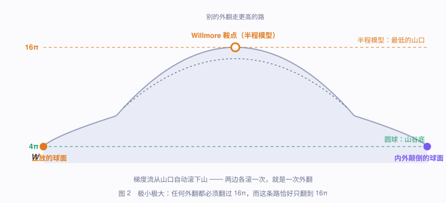

这个策略非常好，因为它给出了一个**自动**的算法：

1. 找到最低的那个山口（一个**鞍点**：沿某个方向是极大，沿其他方向是极小）；
2. 站在山口上，往不稳定的那个方向**推一下**；
3. 然后就撒手 —— 让它顺着重力（能量的负梯度）自己滚下去。

它会滚到某个谷底。往另一边推，它滚到另一个谷底。两段拼起来就是一次完整的外翻。

**没有人需要事先知道路上长什么样。** 这就是这篇论文与之前所有外翻方法的根本区别。

现在的问题变成三个具体的：**海拔是什么？最低山口在哪儿？怎么让它滚？**

---

## 3. 海拔：弹性弯曲能

### 3.1 曲率

先回忆曲线的曲率：一条曲线在某点的曲率 $\kappa = 1/R$，其中 $R$ 是最贴合这一点的那个圆的半径。越弯，$\kappa$ 越大。

曲面复杂一点，因为不同方向弯曲程度不同。在曲面上取一点 $p$ 和它的单位法向 $\mathbf{n}$，用一个含 $\mathbf{n}$ 的平面去切曲面，切出一条曲线，它有一个曲率。转动这个平面，曲率会变化，它的最大值和最小值叫**主曲率** $\kappa_1, \kappa_2$。定义

$$H = \frac{\kappa_1+\kappa_2}{2} \quad(\text{平均曲率}), \qquad K = \kappa_1\kappa_2 \quad(\text{高斯曲率}).$$

半径 $R$ 的球面上处处 $\kappa_1=\kappa_2=1/R$，所以 $H = 1/R$，$K = 1/R^2$。

> **符号约定**：把形状算子取成 $S(X) = D_X\mathbf{n}$（$\mathbf{n}$ 取外法向），则球面的 $H=1/R>0$。不同教材差一个正负号，但下面用到的能量只含 $H^2$，所以无所谓。

**弹性弯曲能**（也叫 Willmore 能）定义为

$$\boxed{\;W(M) = \int_M H^2\, dA\;}$$

物理意义：一张薄弹性膜被弯曲时储存的弹性能，正比于弯曲量的平方沿曲面的积分。这是我们的"海拔"。

### 3.2 关键推导：面积的第一变分

下面这条式子是整篇文章的枢纽 —— 它把"曲率"和"面积"连起来，而面积在离散网格上是**平凡可算**的。这就是后面能把连续问题变成代码的原因。

**命题.** 把曲面沿法向推动 $\varphi\,\mathbf{n}$（$\varphi$ 是曲面上的函数，可正可负），则面积元的变化为

$$\delta(dA) = 2H\varphi \, dA .$$

**推导.** 用参数 $(u,v)$ 写曲面 $\mathbf{x}(u,v)$，面积元是 $dA = |\mathbf{x}_u\times\mathbf{x}_v|\,du\,dv$。把曲面推成 $\mathbf{x} + \varepsilon\varphi\mathbf{n}$，求导：

$$(\mathbf{x}+\varepsilon\varphi\mathbf{n})_u = \mathbf{x}_u + \varepsilon(\varphi_u\mathbf{n} + \varphi\,\mathbf{n}_u),\qquad
(\mathbf{x}+\varepsilon\varphi\mathbf{n})_v = \mathbf{x}_v + \varepsilon(\varphi_v\mathbf{n} + \varphi\,\mathbf{n}_v).$$

叉乘并保留 $\varepsilon$ 的一次项：

$$\mathbf{x}_u\times\mathbf{x}_v + \varepsilon\Big[\varphi\big(\mathbf{x}_u\times\mathbf{n}_v + \mathbf{n}_u\times\mathbf{x}_v\big) + \varphi_v\,\mathbf{x}_u\times\mathbf{n} + \varphi_u\,\mathbf{n}\times\mathbf{x}_v\Big].$$

现在用一个小技巧：对向量 $\mathbf{a}$ 和小扰动 $\mathbf{b}$，有 $|\mathbf{a}+\varepsilon\mathbf{b}| = |\mathbf{a}| + \varepsilon\,\frac{\mathbf{a}\cdot\mathbf{b}}{|\mathbf{a}|} + O(\varepsilon^2)$。这里 $\mathbf{a} = \mathbf{x}_u\times\mathbf{x}_v$ **平行于 $\mathbf{n}$**，所以只有 $\mathbf{b}$ 沿 $\mathbf{n}$ 的分量有贡献。而 $\mathbf{x}_u\times\mathbf{n}$ 和 $\mathbf{n}\times\mathbf{x}_v$ 都**垂直于** $\mathbf{n}$ —— 含 $\varphi_u,\varphi_v$ 的两项直接消失了。

> 这一步就是"只有法向运动改变面积"的严格版本：沿切向滑动曲面上的点，形状不变，面积当然也不变。

剩下要算 $(\mathbf{x}_u\times\mathbf{n}_v + \mathbf{n}_u\times\mathbf{x}_v)\cdot\mathbf{n}$。用 Weingarten 关系 $\mathbf{n}_u = S(\mathbf{x}_u),\ \mathbf{n}_v = S(\mathbf{x}_v)$：

$$\mathbf{x}_u\times S(\mathbf{x}_v) + S(\mathbf{x}_u)\times\mathbf{x}_v .$$

这里需要一条二维线性代数的小恒等式：**对切平面上的线性映射 $S$，有 $\mathbf{a}\times S\mathbf{b} + S\mathbf{a}\times\mathbf{b} = (\operatorname{tr}S)(\mathbf{a}\times\mathbf{b})$。**

*证明*：设 $S\mathbf{a} = \alpha\mathbf{a}+\gamma\mathbf{b}$，$S\mathbf{b} = \beta\mathbf{a}+\delta\mathbf{b}$，则 $\operatorname{tr}S = \alpha+\delta$。于是
$S\mathbf{a}\times\mathbf{b} = \alpha(\mathbf{a}\times\mathbf{b})$，$\mathbf{a}\times S\mathbf{b} = \delta(\mathbf{a}\times\mathbf{b})$，相加即得。$\square$

而 $\operatorname{tr}S = \kappa_1+\kappa_2 = 2H$，所以那一坨等于 $2H(\mathbf{x}_u\times\mathbf{x}_v)$，点乘 $\mathbf{n}$ 得 $2H|\mathbf{x}_u\times\mathbf{x}_v|$。代回去：

$$\delta(dA) = 2H\varphi\,dA. \qquad\blacksquare$$

**验算**：半径 $R$ 的球面外推 $\varphi$，面积从 $4\pi R^2$ 变成 $4\pi(R+\varphi)^2$，增量 $8\pi R\varphi = 2\cdot\frac{1}{R}\cdot\varphi\cdot 4\pi R^2$ ✓。

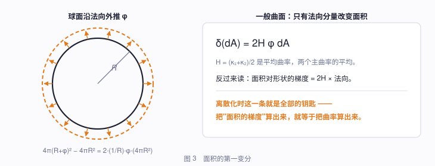

**这条式子反过来读，才是它真正的威力：**

$$\text{面积对形状的梯度} \;=\; 2H \times \text{法向}.$$

也就是说，**只要会算面积的梯度，就等于会算平均曲率**。而三角网格的面积是一堆叉乘，闭着眼睛都能求导。第 5、6 节全靠这一条。

### 3.3 圆球是唯一的谷底：$W \ge 4\pi$

先算两件小事。

**(a) $W$ 是尺度不变的。** 把曲面放大 $\lambda$ 倍：曲率变成 $H/\lambda$，面积元变成 $\lambda^2 dA$，于是 $H^2dA$ 不变，$W$ 不变。所以"大球"和"小球"海拔一样 —— 这很合理，弯曲程度是个形状概念。

**(b) 圆球的 $W = 4\pi$。** $\int_{S^2_R} (1/R)^2 dA = \frac{1}{R^2}\cdot 4\pi R^2 = 4\pi$，和 $R$ 无关 ✓。

**定理（Willmore）.** 对 $\mathbb{R}^3$ 中任意闭曲面，$W \ge 4\pi$，取等当且仅当它是圆球。

**推导.** 分三步。

**① $H^2 \ge K$。** 因为

$$H^2 - K = \left(\frac{\kappa_1+\kappa_2}{2}\right)^2 - \kappa_1\kappa_2 = \left(\frac{\kappa_1-\kappa_2}{2}\right)^2 \ge 0 .$$

**② 高斯映射至少铺满球面一次。** 高斯映射 $N: M \to S^2$ 把每点送到它的单位外法向。取任意单位向量 $\mathbf{u}$，考虑函数 $p \mapsto \langle p, \mathbf{u}\rangle$ 在紧致曲面 $M$ 上的**最大值点** $p_\mathbf{u}$。在那里，整个曲面都落在过 $p_\mathbf{u}$ 且垂直于 $\mathbf{u}$ 的平面的**同一侧**，所以曲面朝同一个方向弯 —— 两个主曲率同号，$K \ge 0$；而且那里的外法向恰好就是 $\mathbf{u}$。

于是：**每个 $\mathbf{u}\in S^2$ 都能在 $\{K\ge 0\}$ 里找到原像**，即 $N(\{K\ge0\}) = S^2$。

**③ $|K|$ 就是高斯映射的雅可比。** 高斯映射的微分是形状算子 $S$，其行列式是 $\kappa_1\kappa_2 = K$。按面积公式，"积分雅可比 $\ge$ 像的面积"：

$$\int_{\{K\ge0\}} K\, dA = \int_{\{K\ge0\}} |\det dN|\, dA \;\ge\; \operatorname{area}(S^2) = 4\pi .$$

三步串起来：

$$W = \int_M H^2 dA \;\ge\; \int_{\{K\ge0\}} H^2 dA \;\overset{①}{\ge}\; \int_{\{K\ge0\}} K\, dA \;\overset{③}{\ge}\; 4\pi .$$

取等要求 ① 处处取等，即处处 $\kappa_1=\kappa_2$（全脐点），这样的闭曲面只有圆球。$\blacksquare$

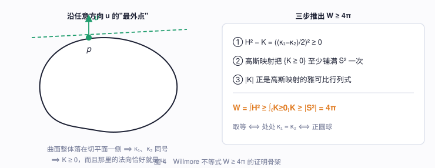

### 3.4 山口的高度：$16\pi$

现在轮到"最低山口有多高"。这里要引用两个更深的结果（证明超出本文范围，但结论好理解）。

**事实 A（Banchoff–Max, 1981）.** 任何球面外翻，中途必定出现**四重点** —— 空间中某一点被曲面的四张切片同时穿过。

这是个纯拓扑的必然性，可以粗略这样感受：外翻过程中自交曲线必须经历一整套"生—灭"，而它们的相交方式在计数上强制出四重点。

**事实 B（Li–Yau 不等式, 1982）.** 若空间中某点被曲面的 $k$ 张切片穿过，则

$$W \ge 4k\pi .$$

$k=1$ 就是 Willmore 不等式。直观上：在那一点做**反演**（下一节会详细讲），$k$ 张切片各自被翻到无穷远，变成 $k$ 张独立的"平面"，每张按 ② ③ 的计数各要付 $4\pi$。

把 A 和 B 拼起来：

> **任何球面外翻，中途必定出现四重点，因而必定翻到 $W \ge 16\pi$ 的高度。**

$16\pi$ 是**理论下界**。而 Bryant 1984 年分类了所有 $W$-临界球面，发现恰好存在 $W = 16\pi$ 的临界点，而且它是**鞍点**（不是极小）。于是：

$$\text{最低山口的高度恰好等于理论下界 } 16\pi .$$

这就是"极小极大"这个名字的来历：在所有外翻路径中取**最大高度最小**的那条。下面要做的，就是把这个山口上的曲面具体写出来。

---

## 4. 半程模型：把山口造出来

### 4.1 极小曲面 = 调和 + 共形

Bryant 的分类说：$W=16\pi$ 的临界球面都是**极小曲面经过反演**得到的。所以我们先要造一个极小曲面。

**极小曲面**就是 $H \equiv 0$ 的曲面（肥皂膜）。它有一个漂亮的复分析描述，推导只需要两行。

用复参数 $w = u + iv$，并要求参数化是**共形**的（保角，即小圆映成小圆）。共形的条件是

$$|\mathbf{x}_u| = |\mathbf{x}_v|, \qquad \mathbf{x}_u\cdot\mathbf{x}_v = 0 .$$

引入 $\displaystyle\frac{\partial \mathbf{x}}{\partial w} = \frac{1}{2}(\mathbf{x}_u - i\,\mathbf{x}_v)$，直接算（这里的"平方"指分量平方和，**不取共轭**）：

$$\frac{\partial\mathbf{x}}{\partial w}\cdot\frac{\partial\mathbf{x}}{\partial w}
= \frac{1}{4}\Big(|\mathbf{x}_u|^2 - |\mathbf{x}_v|^2 - 2i\,\mathbf{x}_u\cdot\mathbf{x}_v\Big).$$

所以

$$\textbf{共形} \iff \frac{\partial\mathbf{x}}{\partial w}\cdot\frac{\partial\mathbf{x}}{\partial w} = 0 . \tag{4.1}$$

另一方面，共形参数下有标准恒等式 $\Delta\mathbf{x} = 2H|\mathbf{x}_u|^2\,\mathbf{n}$。因此

$$\textbf{极小} \iff \Delta\mathbf{x} = 0 \iff \mathbf{x}\ \text{的每个分量都是调和函数}.$$

而调和函数正是全纯函数的实部。于是：

$$\mathbf{x}(w) = \operatorname{Re}\,\boldsymbol{\Phi}(w), \qquad \boldsymbol{\Phi}: \Omega \to \mathbb{C}^3 \ \text{全纯},\ \ \boldsymbol{\Phi}'\cdot\boldsymbol{\Phi}' = 0 .$$

条件 $\boldsymbol{\Phi}'\cdot\boldsymbol{\Phi}'=0$ 有一个通解（**Weierstrass 表示**）：取全纯函数 $f$ 和亚纯函数 $g$，令

$$\boldsymbol{\Phi}' = \Big(\tfrac{1}{2}f(1-g^2),\ \tfrac{i}{2}f(1+g^2),\ fg\Big). \tag{4.2}$$

**验证**（一行）：

$$\tfrac{1}{4}f^2(1-g^2)^2 - \tfrac{1}{4}f^2(1+g^2)^2 + f^2g^2 = \tfrac{1}{4}f^2\big[(1-g^2)^2-(1+g^2)^2\big] + f^2g^2 = -f^2g^2 + f^2g^2 = 0\ ✓$$

$g$ 有个几何意义：它正是**高斯映射的球极投影**。

### 4.2 Kusner 的公式

Kusner 找到的、带 4 重对称的那张极小曲面是：

$$\boxed{\;\tilde h(w) \;=\; \operatorname{Re}\left[\frac{\big(\,i(w^3-w),\ \ w^3+w,\ \ \tfrac{i}{2}(w^4+1)\,\big)}{w^4 + 2\sqrt{3}\,w^2 - 1}\right]\;} \tag{4.3}$$

定义域是黎曼球面 $\hat{\mathbb{C}} = \mathbb{C}\cup\{\infty\}$ 挖掉分母的四个零点。

它确实是 (4.2) 的形式吗？把 (4.3) 记作 $\operatorname{Re}\boldsymbol{\Phi}$，按 (4.2) 反解 $f = \Phi_1' - i\Phi_2'$、$g = \Phi_3'/f$，可以整理出闭形式（我用数值微分反推再验证，两者吻合到 $10^{-9}$，即有限差分的精度）：

$$g(w) = \frac{w(w^2-\sqrt3)}{\sqrt3\,w^2+1}, \qquad
f(w) = \frac{2i\,(\sqrt3\,w^2+1)^2}{\big(w^4+2\sqrt3\,w^2-1\big)^2}. \tag{4.4}$$

*（$f$ 的推导：由 $\Phi_3 = \frac{i}{2}\frac{w^4+1}{D}$，$D = w^4+2\sqrt3w^2-1$，直接求导得*
*$\Phi_3' = \frac{i}{2}\cdot\frac{4w^3 D - (w^4+1)(4w^3+4\sqrt3 w)}{D^2} = 2iw\cdot\frac{\sqrt3 w^4 - 2w^2-\sqrt3}{D^2}$，*
*而 $\sqrt3w^4-2w^2-\sqrt3 = (w^2-\sqrt3)(\sqrt3w^2+1)$，于是 $f = \Phi_3'/g$ 就是上式。）*

$g$ 是 3 次有理映射，所以**高斯映射的次数是 3** —— 这个数一会儿要用。

### 4.3 四个"平面端"

分母 $D(w) = w^4+2\sqrt3 w^2-1$ 的零点：令 $t=w^2$，

$$t = \frac{-2\sqrt3 \pm \sqrt{12+4}}{2} = -\sqrt3 \pm 2 \;\Longrightarrow\; w^2 = 2-\sqrt3 \ \text{ 或 }\ w^2 = -(2+\sqrt3),$$

$$w = \pm\sqrt{2-\sqrt3} \approx \pm 0.5176, \qquad w = \pm i\sqrt{2+\sqrt3} \approx \pm 1.9319\,i .$$

注意 $\sqrt{2-\sqrt3}\cdot\sqrt{2+\sqrt3} = \sqrt{4-3} = 1$ —— 两个模互为倒数，这个巧合下一节会变成对称性。

这四个点叫**刺点**（puncture）。在它们附近 $|\tilde h| \to \infty$，曲面伸向无穷远。可以验证 $D$ 的四个零点都是**单根**（$D' = 4w(w^2+\sqrt3)$ 的零点 $w=0$ 和 $w^2=-\sqrt3$ 处 $D$ 分别取 $-1$ 和 $-4$，都不为零），所以 $\boldsymbol{\Phi}$ 在那里是**单极点**，即

$$\tilde h(w) \approx \operatorname{Re}\frac{\mathbf{A}}{w-w_0} + O(1).$$

这种端叫**平面端**（planar end）：曲面在无穷远处越来越平，渐近于一张平面。四个刺点 ⟹ **四张伸向无穷远的平面**。

另外两个特殊点：$w=0$ 时 $\boldsymbol{\Phi} = (0,0,\tfrac{i}{2})/(-1)$，实部 $=(0,0,0)$；$w\to\infty$ 时分子分母都是 4 次，$\boldsymbol{\Phi} \to (0,0,\tfrac{i}{2})$，实部也是 $(0,0,0)$。**黎曼球面的两个极点都被映到原点** —— 这是曲面上两片相切的地方。

### 4.4 4 重对称：完整手算

论文最关键的结构是一个 4 阶对称。定义黎曼球面上的映射

$$\sigma(w) = \frac{i}{\bar w}.$$

**它是 4 阶的**：

$$\sigma^2(w) = \sigma\!\left(\frac{i}{\bar w}\right) = \frac{i}{\overline{(i/\bar w)}} = \frac{i}{-i/w} = -w
\;\Longrightarrow\; \sigma^4 = \mathrm{id}.$$

而且它含 $\bar w$，是**反全纯**的 —— 它**反转**黎曼球面的定向。记住这一点，它是整篇文章的关键。

**现在证明 $\tilde h \circ \sigma = \rho_4 \circ \tilde h$，其中 $\rho_4$ 是绕 $z$ 轴转 $90°$。**

分两步。记 $N_1 = i(w^3-w),\ N_2 = w^3+w,\ N_3 = \tfrac{i}{2}(w^4+1)$，$D = w^4+2\sqrt3w^2-1$。

**第一步：$w \mapsto \bar w$。** $D$ 的系数全是实数，所以 $D(\bar w) = \overline{D(w)}$。而

$$N_1(\bar w) = i(\bar w^3-\bar w) = i\,\overline{(w^3-w)} = \overline{-i(w^3-w)} = -\overline{N_1(w)},$$
$$N_2(\bar w) = \overline{N_2(w)}, \qquad N_3(\bar w) = \tfrac{i}{2}\overline{(w^4+1)} = -\overline{N_3(w)} .$$

于是 $\Phi_1(\bar w) = -\overline{\Phi_1(w)}$，$\Phi_2(\bar w) = \overline{\Phi_2(w)}$，$\Phi_3(\bar w) = -\overline{\Phi_3(w)}$。取实部（$\operatorname{Re}\bar z = \operatorname{Re}z$）：

$$\tilde h(\bar w) = (-x,\ y,\ -z) \qquad\text{其中 } (x,y,z) = \tilde h(w). \tag{4.5}$$

**第二步：$w \mapsto i/w$。** 代入 $v = i/w$：

$$v^3-v = \frac{i^3}{w^3}-\frac{i}{w} = -\frac{i(1+w^2)}{w^3},\qquad
v^3+v = \frac{i(w^2-1)}{w^3},\qquad
v^4+1 = \frac{1+w^4}{w^4},$$

$$D(v) = \frac{1}{w^4} + 2\sqrt3\cdot\frac{i^2}{w^2} - 1 = \frac{1-2\sqrt3w^2-w^4}{w^4} = -\frac{D(w)}{w^4}.$$

逐个分量：

$$\Phi_1(v) = \frac{i\cdot\left(-\frac{i(1+w^2)}{w^3}\right)}{-\frac{D(w)}{w^4}} = \frac{\frac{1+w^2}{w^3}\cdot(-w^4)}{D(w)} = -\frac{w^3+w}{D(w)} = -\Phi_2(w),$$

$$\Phi_2(v) = \frac{\frac{i(w^2-1)}{w^3}}{-\frac{D(w)}{w^4}} = -\frac{i\,w(w^2-1)}{D(w)} = -\frac{i(w^3-w)}{D(w)} = -\Phi_1(w),$$

$$\Phi_3(v) = \frac{\frac{i}{2}\cdot\frac{1+w^4}{w^4}}{-\frac{D(w)}{w^4}} = -\frac{\frac{i}{2}(w^4+1)}{D(w)} = -\Phi_3(w).$$

取实部：

$$\tilde h(i/w) = (-y,\ -x,\ -z). \tag{4.6}$$

**合起来。** $\sigma(w) = i/\bar w$，先做 (4.5) 再做 (4.6)：设 $\tilde h(\bar w) = (X,Y,Z) = (-x,y,-z)$，则

$$\tilde h(i/\bar w) = (-Y,\ -X,\ -Z) = (-y,\ x,\ z).$$

而 $(x,y,z)\mapsto(-y,x,z)$ 正是**绕 $z$ 轴逆时针转 $90°$**。所以

$$\boxed{\;\tilde h(\sigma(w)) = \rho_4\big(\tilde h(w)\big),\qquad \rho_4 = R_z(90°).\;} \tag{4.7}$$

**这个对称有一个致命的性质**：$\sigma$ 反转定向，所以 $\rho_4$ 虽然在空间里只是个旋转，作用在曲面上却**交换了曲面的两面** —— 把这张球面涂成内橙外蓝，转 $90°$ 后它回到原位，但颜色对调了。这叫**反定向的 4 重对称**。

顺手验证四个刺点构成 $\sigma$ 的一个轨道：$\sigma(0.5176) = i/0.5176 = 1.9319i$ ✓，$\sigma(1.9319i) = i/\overline{1.9319i} = i/(-1.9319i) = -0.5176$ ✓。四个刺点转一圈回到自己。

### 4.5 反演：把无穷远收回来

现在 $\tilde M = \tilde h(\hat{\mathbb{C}}\setminus\{4\text{ 点}\})$ 是个**非紧**曲面，四张平面伸向无穷。要得到紧致曲面，用**反演**：

$$I(\mathbf{x}) = \mathbf{c} + \frac{\mathbf{x}-\mathbf{c}}{|\mathbf{x}-\mathbf{c}|^2}, \qquad \mathbf{c} = (0,0,s).$$

反演的核心性质是 $I(\infty) = \mathbf{c}$：**无穷远被拉回到中心点**。于是四张伸向无穷的平面，各自变成一张**穿过 $\mathbf{c}$ 的曲面片** —— 四张切片交于同一点，正是我们要的**四重点**！

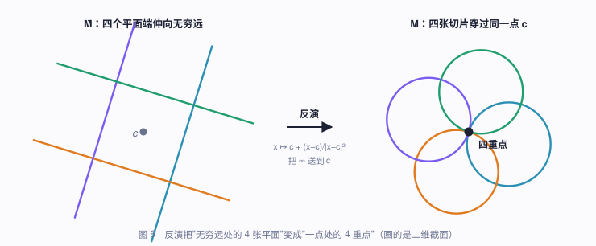

论文取 $s = 0.35$（"没有特别理由，纯为美观"）。为什么中心必须放在 $z$ 轴上？因为要保住 (4.7) 的 4 重对称：$\rho_4$ 是绕 $z$ 轴的旋转，只有中心在轴上时反演才和它交换。

于是**半程模型**

$$h_0 = I \circ \tilde h$$

是一张紧致的浸入球面，带一个位于 $(0,0,0.35)$ 的四重点，并保有反定向的 4 重对称。

另一个可以直接验算的点：$\tilde h$ 把两个极点送到原点，而

$$I(\mathbf{0}) = (0,0,s) + \frac{(0,0,-s)}{s^2} = \Big(0,\,0,\,s-\tfrac{1}{s}\Big) = (0,0,-2.507)\quad (s=0.35).$$

这就是论文说的**极点等距点**（isthmus point）。我在代码里量出的模型 $z$ 方向最低点是 $-2.507$ —— 和公式一致到小数点后三位，这是第一个"公式没写错"的验证。

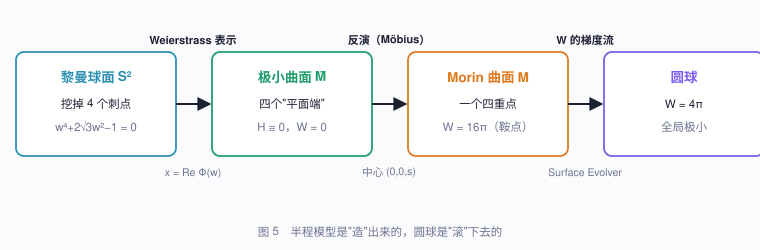

### 4.6 为什么恰好是 $16\pi$

最后确认这张曲面站在正确的高度。需要一条事实：

**事实 C（Möbius 不变性）.** 量 $\int(H^2-K)\,dA$ 在 $\mathbb{R}^3\cup\{\infty\}$ 的 Möbius 变换（平移、旋转、放缩、反演生成的群）下不变。

对紧致亏格 0 曲面（球面拓扑），Gauss–Bonnet 给出 $\int_M K\,dA = 4\pi$，所以

$$\int_M (H^2-K)\,dA = W(M) - 4\pi .$$

另一边，$\tilde M$ 是极小曲面，$H\equiv 0$，所以

$$\int_{\tilde M}(H^2-K)\,dA = -\int_{\tilde M} K\,dA .$$

而完全极小曲面的**总曲率** $= -4\pi\cdot\deg(g)$。由 (4.4)，$\deg g = 3$，故 $\int_{\tilde M}K\,dA = -12\pi$。

$M$ 与 $\tilde M$ 只差一个反演（挖掉四个点不影响积分），所以两个积分相等：

$$W(M) - 4\pi = 12\pi \;\Longrightarrow\; \boxed{W(M) = 16\pi}\ ✓$$

**这张曲面正好坐在理论下界上。** 它就是最低的那个山口。

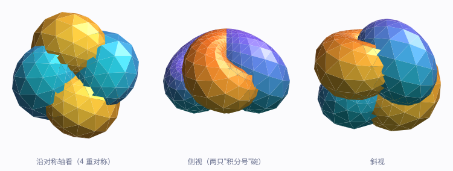

上图是我按 (4.3) 直接算出来的半程模型。左图沿对称轴看，四只碗呈 4 重对称、颜色交替 —— 转 $90°$ 回到自身但内外互换，这正是 (4.7) 的视觉版本。

---

## 5. 离散化：三角网上的曲率

理论到此为止，下面是怎么让电脑算。

曲面用**三角网格**表示：一堆顶点 $\mathbf{x}_1,\dots,\mathbf{x}_n$ 和一堆三角形。现在要在网格上定义 $W$。

关键就是 §3.2 那条式子的逆用：**面积的梯度里藏着曲率**。

对顶点 $v$，定义两个量：

$$A_v = \frac{1}{3}\sum_{f \ni v}\operatorname{area}(f) \quad(\text{顶点星形面积的 }1/3), \qquad
\mathbf{K}_v = \frac{\partial\, A_{\text{总}}}{\partial\, \mathbf{x}_v} .$$

$\mathbf{K}_v$ 就是"把顶点 $v$ 往哪推、总面积涨得最快"的方向。按 §3.2，连续版本说这等于 $2H\mathbf{n}$ 乘以该点所辖的面积，所以离散地

$$|\mathbf{K}_v| \approx 2 H_v A_v \;\Longrightarrow\; H_v = \frac{|\mathbf{K}_v|}{2A_v},$$

于是**离散弯曲能**

$$\boxed{\;\mathcal{W} = \sum_v H_v^2 A_v = \sum_v \frac{|\mathbf{K}_v|^2}{4A_v}\;} \tag{5.1}$$

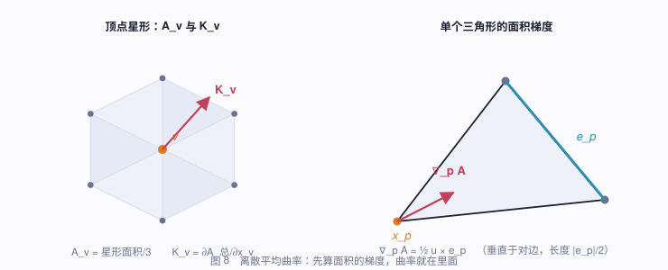

**圆球验算**：半径 $R$ 的球面上 $|\mathbf{K}_v| = 2A_v/R$，代入得每项 $= A_v/R^2$，求和 $= A_{\text{总}}/R^2 = 4\pi$ ✓。

数值上（我的实现，把球面剖分成 $k^2$ 个三角形的正八面体）：

| 面数 | $\mathcal{W}$（圆球） | $\mathcal{W}$（半程模型） |
|---:|---:|---:|
| 512 | 12.428 | 43.20 |
| 1152 | 12.503 | 46.29 |
| 2048 | 12.530 | 47.79 |
| 8192 | 12.557 | 49.57 |
| **理论值** | **$4\pi = 12.566$** | **$16\pi = 50.265$** |

两列都单调收敛到理论值 —— 公式和离散化都没问题。

> ⚠️ 注意离散 $\mathcal{W}$ **从下方**逼近。粗网格上它系统性偏低，所以代码里判断"是否已经变回圆球"时，阈值要用**同一剖分下圆球的离散能量**（表中第二列），而不是 $4\pi$。这是个容易踩的坑。

---

## 6. 梯度：一个可以手算的闭式解

要让曲面滚下山，需要 $\partial\mathcal{W}/\partial\mathbf{x}_p$。

最省事的办法是差分：挪动每个顶点一点点，看能量变多少。因为 $\mathcal{W}$ 是局部的（顶点 $v$ 的能量只依赖它和邻居），差分只需重算一小片，代价可以接受。但它慢，而且精度受限。下面推一个**闭式解**。

### 6.1 单个三角形的面积梯度

三角形顶点 $\mathbf{x}_0,\mathbf{x}_1,\mathbf{x}_2$。记**对边向量** $\mathbf{e}_i = \mathbf{x}_{i+2}-\mathbf{x}_{i+1}$（下标模 3），法向量 $\mathbf{N} = (\mathbf{x}_1-\mathbf{x}_0)\times(\mathbf{x}_2-\mathbf{x}_0)$，面积 $= |\mathbf{N}|/2$，单位法向 $\mathbf{u} = \mathbf{N}/|\mathbf{N}|$。

先求 $\mathbf{N}$ 对顶点的导数。把 $\mathbf{x}_0$ 沿 $\mathbf{v}$ 动：

$$\delta\mathbf{N} = (-\mathbf{v})\times(\mathbf{x}_2-\mathbf{x}_0) + (\mathbf{x}_1-\mathbf{x}_0)\times(-\mathbf{v})
= \mathbf{v}\times\big[(\mathbf{x}_1-\mathbf{x}_0)-(\mathbf{x}_2-\mathbf{x}_0)\big] = \mathbf{v}\times(\mathbf{x}_1-\mathbf{x}_2) = \mathbf{e}_0\times\mathbf{v}.$$

对 $\mathbf{x}_1,\mathbf{x}_2$ 同样可得。统一写成

$$\frac{\partial\mathbf{N}}{\partial\mathbf{x}_p} = [\mathbf{e}_p]_\times \qquad(\text{叉乘矩阵}). \tag{6.1}$$

于是面积的梯度（用 $\partial|\mathbf{N}|/\partial\mathbf{N} = \mathbf{u}$）：

$$\boxed{\;\nabla_p\!\operatorname{area} = \tfrac{1}{2}\,\mathbf{u}\times\mathbf{e}_p\;} \tag{6.2}$$

**几何检验**：这个向量垂直于对边、落在三角形平面内、长度 $|\mathbf{e}_p|/2$。确实：面积 $=\frac{1}{2}\cdot\text{底}\cdot\text{高}$，顶点沿高的方向移动单位距离，面积增加 $\frac{1}{2}|\mathbf{e}_p|$ ✓。

### 6.2 面积的 Hessian

再求一次导。由 $\nabla_p\operatorname{area} = -\frac{1}{2}[\mathbf{e}_p]_\times\mathbf{u}$，

$$\mathbf{H}_{pq} := \frac{\partial^2 \operatorname{area}}{\partial\mathbf{x}_p\,\partial\mathbf{x}_q}
= -\tfrac{1}{2}[\mathbf{e}_p]_\times\frac{\partial\mathbf{u}}{\partial\mathbf{x}_q} + \tfrac{1}{2}[\mathbf{u}]_\times\frac{\partial\mathbf{e}_p}{\partial\mathbf{x}_q}.$$

其中 $\dfrac{\partial\mathbf{u}}{\partial\mathbf{x}_q} = \dfrac{1}{|\mathbf{N}|}(I-\mathbf{u}\mathbf{u}^{\mathsf T})[\mathbf{e}_q]_\times$（单位化的导数），
$\dfrac{\partial\mathbf{e}_p}{\partial\mathbf{x}_q} = (\delta_{q,p+2}-\delta_{q,p+1})I$。所以

$$\mathbf{H}_{pq} = -\frac{1}{2|\mathbf{N}|}[\mathbf{e}_p]_\times(I-\mathbf{u}\mathbf{u}^{\mathsf T})[\mathbf{e}_q]_\times
\;+\;\tfrac{1}{2}(\delta_{q,p+2}-\delta_{q,p+1})[\mathbf{u}]_\times . \tag{6.3}$$

### 6.3 组装

记 $\mathbf{c}_v = \dfrac{\mathbf{K}_v}{2A_v}$（离散平均曲率向量），$w_v = |\mathbf{c}_v|^2$。则 $\mathcal{W} = \sum_v w_v A_v$，且

$$\frac{\partial\mathcal{W}}{\partial\mathbf{x}_p}
= \sum_v\left[\frac{\mathbf{K}_v}{2A_v}\cdot\frac{\partial\mathbf{K}_v}{\partial\mathbf{x}_p} - \frac{|\mathbf{K}_v|^2}{4A_v^2}\frac{\partial A_v}{\partial\mathbf{x}_p}\right]
= \sum_v\left[\mathbf{c}_v\cdot\frac{\partial\mathbf{K}_v}{\partial\mathbf{x}_p} - w_v\frac{\partial A_v}{\partial\mathbf{x}_p}\right].$$

两项都能整理成**逐三角形累加**：

- 第二项：$A_v$ 只有 $1/3$ 份来自每个三角形，所以
 $\sum_v w_v\frac{\partial A_v}{\partial\mathbf{x}_p} = \frac{1}{3}\sum_{f\ni p}\Big(\sum_{v\in f}w_v\Big)\nabla_p\operatorname{area}(f)$。

- 第一项：$\mathbf{K}_v = \sum_{f\ni v}\nabla_v\operatorname{area}(f)$，所以 $\dfrac{\partial\mathbf{K}_v}{\partial\mathbf{x}_p}$ 就是各三角形的面积 Hessian 之和。利用 Hessian 的对称性 $\mathbf{H}_{vp}^{\mathsf T} = \mathbf{H}_{pv}$，第一项对每个三角形的贡献是 $\sum_{v\in f}\mathbf{H}_{pv}\mathbf{c}_v$。

把 (6.3) 代进去，注意 $[\mathbf{e}_p]_\times$ 可以提到求和号外面，令

$$\mathbf{q} = \sum_{v\in f}\mathbf{e}_v\times\mathbf{c}_v, \qquad \mathbf{P} = \mathbf{q}-(\mathbf{u}\cdot\mathbf{q})\mathbf{u},$$

最终得到**每个三角形对每个顶点的完整贡献**：

$$\boxed{\;
\frac{\partial\mathcal{W}}{\partial\mathbf{x}_p}\Bigg|_f
= -\frac{\mathbf{e}_p\times\mathbf{P}}{2|\mathbf{N}|}
\;+\;\frac{\mathbf{u}\times(\mathbf{c}_{p+2}-\mathbf{c}_{p+1})}{2}
\;-\;\frac{w_0+w_1+w_2}{6}\,\big(\mathbf{u}\times\mathbf{e}_p\big)\;}
\tag{6.4}$$

只有**九个叉乘**。整个梯度只需要扫两遍三角形表。

### 6.4 验证

推这么长的式子，必须验。我把 (6.4) 和中心差分梯度逐分量比较：

- 最大相对误差 **$5.5\times10^{-10}$**（差分本身的精度水平）；
- 速度：1026 个顶点上，解析梯度 **0.355 ms**，差分梯度 **5.2 ms** —— **快 15 倍**。

这 15 倍是整个 demo 能在浏览器里现算的原因。

---

## 7. 让它真的滚起来

有了梯度，最朴素的做法是 $\mathbf{x} \leftarrow \mathbf{x} - \tau\nabla\mathcal{W}$。但直接这么干会**慢到不可用**。原因值得单独说，因为这是所有高阶几何流的通病。

### 7.1 为什么四阶流这么难

取一个几乎平的曲面，写成图 $z = \phi(x,y)$。小斜率下 $H \approx \frac{1}{2}\Delta\phi$，所以

$$\mathcal{W} \approx \frac{1}{4}\int(\Delta\phi)^2,\qquad
\nabla\mathcal{W} \approx \tfrac{1}{2}\Delta^2\phi .$$

梯度流是 $\dot\phi = -\frac{1}{2}\Delta^2\phi$ —— 一个**四阶**抛物方程。对傅里叶模 $e^{i\mathbf{k}\cdot\mathbf{x}}$，衰减率是 $\frac{1}{2}|\mathbf{k}|^4$。

显式步长必须让**最快的**模式稳定。网格间距 $h$ 时 $k_{\max}\sim\pi/h$，于是

$$\tau \lesssim \frac{4h^4}{\pi^4}.$$

$h$ 减半，步长要减到 $1/16$。同时最慢的模式（$k\sim1$）衰减率只有 $O(1)$。两者相差 $k_{\max}^4$ —— 千个顶点的网格上就是 $10^6$ 到 $10^7$ 量级。**你被迫用适合最快模式的步长，去等最慢模式演化完。**

### 7.2 Sobolev 预条件

解法是换一个"下降方向"。不用 $\nabla\mathcal{W}$ 本身，而用它的**平滑版**：

$$\mathbf{d} = (I+\beta L)^{-2}\,\nabla\mathcal{W},$$

其中 $L$ 是网格的图 Laplacian（$L \approx -h^2\Delta$）。在傅里叶侧，这给每个模式乘上 $\dfrac{1}{(1+\beta h^2k^2)^2}$，于是衰减率变成

$$\frac{k^4/2}{(1+\beta h^2 k^2)^2} \;\xrightarrow{\ k\ \text{很大}\ }\; \frac{1}{2\beta^2h^4} \quad(\text{饱和，不再随 }k\text{ 增长}).$$

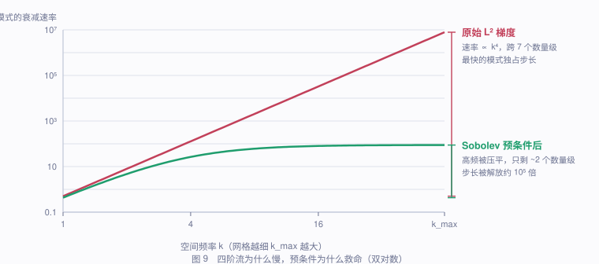

速率的**跨度**从 7 个数量级压到 2 个左右 —— 这就是能用大步长的原因。

代码里我没有精确求逆，而是对 $(I+\beta L)\mathbf{d} = \mathbf{g}$ 做 20 次 Jacobi 迭代、连做两遍（$\beta=30$）。这远没有收敛，实际上只是个"低通滤波器"，但方向仍然满足 $\nabla\mathcal{W}\cdot\mathbf{d} > 0$（下降方向），效果已经足够。

> **为什么仍是下降方向？** 若 $M$ 正定对称，则 $\mathbf{g}\cdot(M\mathbf{g}) > 0$。Jacobi 迭代给出的是 $M$ 的多项式近似，代码里额外检查了这个内积，为负就退回原始梯度。

### 7.3 其余四件工程事

- **共轭梯度**。用 Polak–Ribière 型非线性共轭梯度替代纯梯度下降。论文脚注里也提到 Evolver 用共轭梯度，理由是"它更擅长沿着高维空间中狭窄倾斜的山谷下行" —— 这正是我们的处境。实测迭代数降了约 1/3。

- **顶点平均**。梯度下降会把三角形拉得奇形怪状。每隔几步，把每个顶点朝邻居的重心挪一点，但**只取切向分量**（法向分量会改变形状）。这就是 Evolver 的 `V` 命令。

- **强制 2 重对称**。论文全程保持绕轴的 2 重空间对称。因为参数球面上的顶点集在 $\sigma$ 下不变，可以直接找到顶点置换 $\pi$，每步做 $\mathbf{x}_v \leftarrow \frac{1}{2}\big(\mathbf{x}_v + R_z(180°)\mathbf{x}_{\pi^2(v)}\big)$。这既省心又抑制数值漂移。

- **投掉 Möbius 零模**。光滑的 $W$ 是 Möbius 不变的，所以梯度流会沿 Möbius 方向**漂移** —— 论文第 3 节明确抱怨过这个假象（"尤其在末期，大片曲面已经是球面、没有理由再动，我们有时会看到跳变或漂移"）。这 10 个方向（平移 3、旋转 3、位似 1、特殊共形 3）作为向量场是可以显式写出来的：

 $$\mathbf{v}_{\text{平移}} = \mathbf{e}_k,\quad \mathbf{v}_{\text{旋转}} = \mathbf{e}_k\times\mathbf{x},\quad \mathbf{v}_{\text{位似}} = \mathbf{x},\quad \mathbf{v}_{\text{共形}} = 2(\mathbf{e}_k\cdot\mathbf{x})\mathbf{x} - |\mathbf{x}|^2\mathbf{e}_k .$$

 每步把下降方向对它们做 Gram–Schmidt 正交投影。这一步**不是论文做的**，但它正好消掉论文抱怨的那个假象，动画因此不再漂移缩放。

---

## 8. 从鞍点上推的那一脚

现在站在山口上。可鞍点处梯度为零 —— 不推它就不动。往哪推？

论文给了关键线索：半程模型的 **Morse 指标是 1**（只有一个不稳定方向），而且**如果强制 4 重对称，它反而是个极小**。

两句话合起来就锁定了答案：**不稳定方向一定不是 4 重对称的**。

怎么精确表达"不是 4 重对称的"？考虑法向扰动 $\mathbf{V} = \varphi\,\mathbf{n}$。关键在于 §4.4 那个致命性质：$\rho_4$ **反转曲面定向**，所以法向按

$$\mathbf{n}(\rho_4 p) = -\rho_4\,\mathbf{n}(p)$$

变换。于是 $\mathbf{V}$ 与对称性相容（即 $\mathbf{V}(\rho_4p) = \rho_4\mathbf{V}(p)$）当且仅当

$$\varphi(\rho_4 p)\,\mathbf{n}(\rho_4p) = \varphi(p)\,\rho_4\mathbf{n}(p) = -\varphi(p)\,\mathbf{n}(\rho_4 p)
\;\Longrightarrow\; \boxed{\varphi(\rho_4 p) = -\varphi(p)}$$

**必须是奇函数。** 现在找一个最简单的：$\rho_4$ 把 $(x,y)$ 变成 $(-y,x)$，取

$$\varphi = x^2-y^2 \;\Longrightarrow\; \varphi(\rho_4 p) = (-y)^2-x^2 = -(x^2-y^2) = -\varphi(p)\ ✓$$

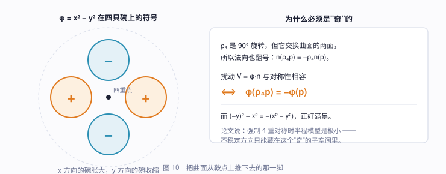

几何上它说：$\pm x$ 方向的两只碗**胀大**，$\pm y$ 方向的两只碗**收缩**。这正是论文描述的"一只碗必然膨胀而另一只收缩"。

于是全部的"人工干预"就是一行：把曲面沿 $(x^2-y^2)\,\mathbf{n}$ 推一个极小的量（我用了平均边长的 8%）。之后梯度下降会把这个方向指数放大，剩下的形状全部是能量自己找的。

---

## 9. 另一半是白送的

到这里我们只能算山口到**一个**谷底。另一半呢？

**不用算。** 论文指出整个外翻满足时间对称

$$h_{-t}(w) = \rho_4\big(h_t(\sigma^{-1}w)\big),\qquad \sigma(w) = \frac{i}{\bar w}. \tag{9.1}$$

$t=0$ 时这就是 (4.7)，成立。而对 $t\ne0$，(9.1) 是把负半程**定义**出来 —— 这是合法的，因为它给出的确实是一条正则同伦，且在 $t=0$ 处与正半程光滑接上。

关键在于 $\sigma$ **反全纯**，反转参数定向。所以：

- $t=+1$ 处是一个圆球；
- $t=-1$ 处是同一个圆球（转了 $90°$，但圆球转了等于没转），**定向相反**。

**定向相反的圆球，就是内外颠倒的圆球。** 外翻完成。

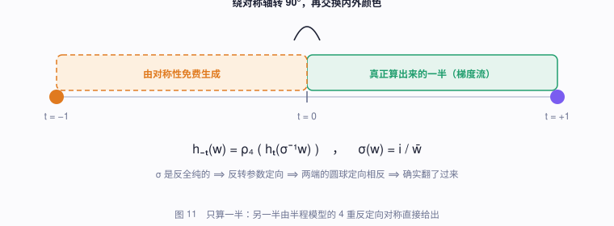

渲染时更是简单到近乎作弊：$\sigma^{-1}$ 只是重新参数化，**不改变曲面在空间中的形状**，只反转定向。所以画 $t<0$ 的帧只需要：

> 取 $|t|$ 那一帧的网格 → 绕 $z$ 轴转 $90°$ → **把内外两面的颜色对调**。

论文里的原话是："第二半可以由第一半倒放、旋转 $90°$、并交换颜色得到。"

---

## 10. 结果与检验

跑起来（我的实现，单线程 JS）：

| 面数 | 迭代数 | 关键帧 | 耗时 | $\mathcal{W}$：起 → 止 | 末态自交段数 | 末态等周比 |
|---:|---:|---:|---:|---:|---:|---:|
| 512 | 3254 | 67 | 1.6 s | 43.3 → 12.06 | **0** | 0.938 |
| 1152 | 4924 | 94 | 5.6 s | 46.3 → 12.36 | **0** | 0.967 |
| 2048 | 6271 | 110 | 12.7 s | 47.8 → 12.53 | **0** | 0.970 |

（等周比 $36\pi V^2/A^3$，圆球为 1。论文全程保持 1000–2000 个三角面，所以 2048 那一行是对标论文的配置；论文在多处理器的 SGI Power Challenge 上算约 10 分钟，得到约 126 个关键帧 —— 1996 年的超算，和今天的一个浏览器标签页。）

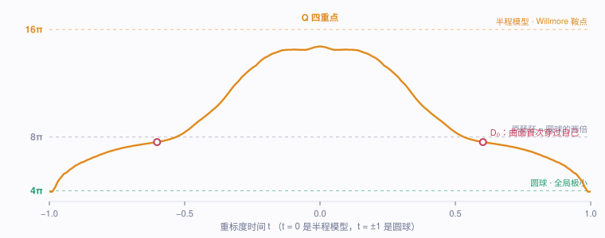

能量曲线正是图 2 那个"翻山"的形状。**注意峰值没到 $16\pi$**：这是 §5 说的离散 $\mathcal{W}$ 从下方逼近，1152 面时半程模型只有 46.3，不是误差 bug。

下面三条检验**不是我预设的**，是算完之后才去量的，所以比较有说服力。

**① 原肠胚坐在 $8\pi$。** 曲线中段有一个长长的平台，能量卡在 $\mathcal{W}\approx 25 \approx 8\pi$ 附近很久。论文说这个阶段"两层同心球面由一条悬链面状的颈相连"，其弯曲能"约为圆球的两倍"，即 $8\pi$ ✓。而且论文解释了为什么这里特别慢：**球面和悬链面都是 $W$-临界的**，大部分区域"没有理由动"，梯度极小 —— 论文自己在这里也必须借助 saddle 步才推得动。我的实现在这一段同样耗掉了近一半的迭代。

**② 自交在 $|t|\approx0.60$ 诞生。** 我另外写了三角形求交算法，逐帧统计自交曲线。结果：

- 从 $|t|=1$（圆球）到 $|t|\approx0.60$，自交段数**恒为 0** —— 曲面是**嵌入**的，没穿过自己；
- 在 $|t|\approx0.60$ 突然由 0 变正，之后单调增长到半程模型的数百段。

论文描述的正是这个：前半段"是一个同痕（isotopy）"，直到"内层球面穿透外层，形成一圈双点和一个透镜状腔室"，即 $D_0$ 灾变。而且 1152 面测得 0.602、2048 面测得 0.607 —— 两个分辨率一致。

**③ 自交曲线的形状对上了论文的图。** 把半程模型的自交曲线单独抽出来，沿对称轴投影：

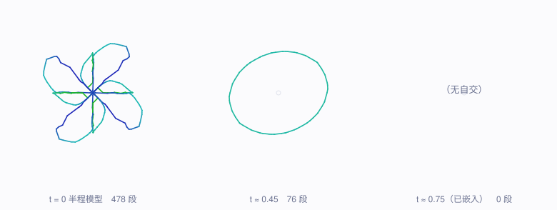

左图与论文 Fig. 5（"从极点方向看到的半程模型的自交曲线示意图"）是同一个图形。我还量了它的对称性：把所有点绕 $z$ 轴转 $90°$，到最近点的最大距离是 **0.0000** —— 4 重对称保持到机器精度。中图是三重点死掉之后剩下的闭圈；右图是 $|t|=0.75$，**空的**，曲面已经嵌入。

另外几个"公式没写错"的硬检验：

- 半程模型的 $\rho_4$ 对称误差：$1.2\times10^{-15}$（机器精度）；
- 极点等距点的位置：量得 $z=-2.507$，公式 $s-1/s = 0.35-1/0.35 = -2.5071$ ✓；
- 末态自交段数为 0，即流真的停在一个**嵌入的**圆球上 —— 这是"外翻确实完成了"的直接证据。

---

## 11. 我的实现与论文的差别

写清楚偏差比声称完美有用：

1. **没有自适应网格加密。** 论文全程做 refine / coarsen / equiangulate 来维持网格质量。我只做了切向顶点平均，连通性固定。代价是末期网格变歪，圆球的等周比停在 0.97 而不是 1.00（512 面时 0.94）。这是当前最大的短板。

2. **投掉了 Möbius 零模。** 论文没做，所以它的动画里有漂移和跳变。我加了这一步，动画干净了，但严格说这改变了流的轨迹（虽然只沿着能量的零方向）。

3. **共形参数化天生不均匀。** 因为 $h_0$ 是共形的，三角形形状很好（近乎等边），但**尺寸**相差可达 14 倍 —— 论文原话是"仍然近乎等边，只是整体上尺寸不均"。论文靠加密解决，我没有。

4. **没有实现 saddle 步。** 论文在原肠胚阶段每 50 步做一次 Hessian 最负特征向量的 saddle 步。我靠共轭梯度硬扛过去，代价是那一段迭代数偏多。

---

## 12. 回头看

这个方法真正漂亮的地方，在于它把一个**拓扑**问题（能不能把球面翻过来）翻译成了一个**变分**问题（沿着能量梯度往下滚），然后交给数值优化。

代价是要先知道山口在哪儿 —— 而这一步用到了相当深的东西（Li–Yau 不等式、Bryant 的分类、极小曲面的 Weierstrass 表示）。但一旦半程模型写下来，剩下的部分是纯粹机械的：算能量、算梯度、下降。

论文作者自己也强调，他们**事先并不知道**这么做会成功：

> "As in all good experiments, we did not know a priori that the evolver would be successful in producing a sphere eversion."

结果不但成功了，而且流自动找出来的那条路径，与 Bernard Morin 三十年前纯靠拓扑直觉设计的外翻是同一个。用论文的话说，"一个最优的几何竟然与纯拓扑学家设想的一致，是数学的一种雄辩的印证"。

---

## 附：自己跑一遍

我把整个方法写成了一个单文件的网页 demo（`index.html`，约 50 KB，canvas + WebGL，无任何外部库）。打开它会**当场**从半程模型开始跑梯度流 —— 屏幕上看到的形状不是预先录好的动画，是正在被算出来的。

可以玩的东西：

- 时间轴拖动 $t\in[-1,1]$，看任意时刻；
- **面片收缩** —— illiVert 的老功能，把每个三角形朝重心缩一点，能看清曲面的层次；
- **沿对称轴剖切** —— 对应论文的 Color Plate 9 剖视图，可以钻进去看四重点；
- **自交曲线**开关 —— 实时算出图 13 那种曲线；
- 保留面片的平面着色（论文特意不用 Gouraud 光滑着色，就是为了让面片可见）。

### 参考

- G. Francis, J. M. Sullivan, R. B. Kusner, K. A. Brakke, C. Hartman, G. Chappell, *The Minimax Sphere Eversion*, in: Hege & Polthier (eds.), **Visualization and Mathematics**, Springer, 1997, pp. 3–20.
- S. Smale, *A classification of immersions of the two-sphere*, Trans. AMS 90 (1958).
- T. J. Willmore, *Note on embedded surfaces*, 1965.
- P. Li, S.-T. Yau, *A new conformal invariant and its applications*, Invent. Math. 69 (1982).
- R. Bryant, *A duality theorem for Willmore surfaces*, J. Diff. Geom. 20 (1984).
- T. Banchoff, N. Max, *Every sphere eversion has a quadruple point*, 1981.
- K. Brakke, **Surface Evolver** —— 论文所用的软件。
