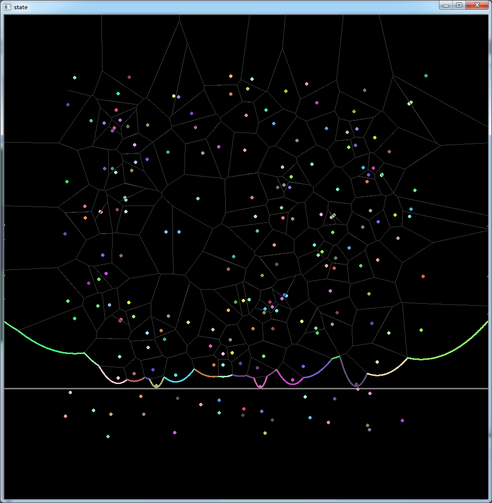

### Overview

Fortune's sweepline algorithm that constructs a Voronoi diagram in O(NlogN) time.

### Detail

In this project I implemented the algorithm using STL map without writing a balanced tree myself.

The beach line is an ordered sequence of parabolas segments. In order to seach for the parabola that is right above the point when a site event happens, I store the parabolas in a map. A parabola is represented by the coordinate of its corresponding site, as well as the coordinates of the neighbors on both side. When the sweepline scans from top to down, the left and right boundaries of the segments can be computed dynamically given the sweepline's y. 

### Features
The intermediate construction results are shown as the sweep line moves down. 

The visualized elements include the sites, the beach line, the sweep line and the Voronoi edges.

Try to change the `show_each_step` parameter to true at line 14.

### Dependency

In order to run this code, OpenCV is required if you want to visualize the process of construction. Or you can remove the OpenCV code and directly get the result of the Voronoi diagram.

### ToDo
1. Organize the result using DCEL structure.
2. The epsilon in float-point comparison matters in some cases, and I have no idea how to solve it properly.
